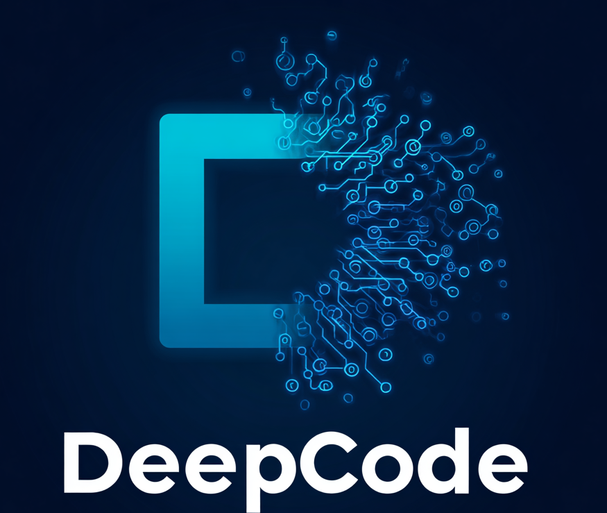
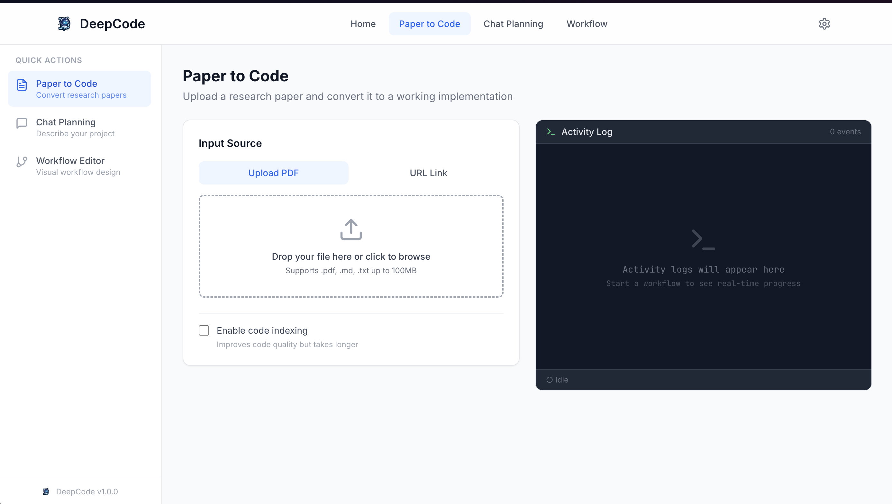
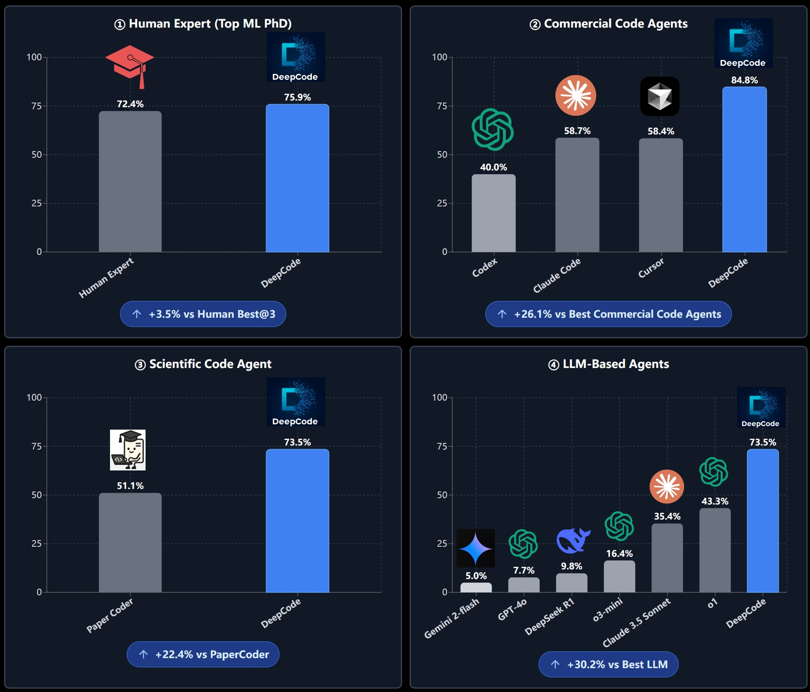
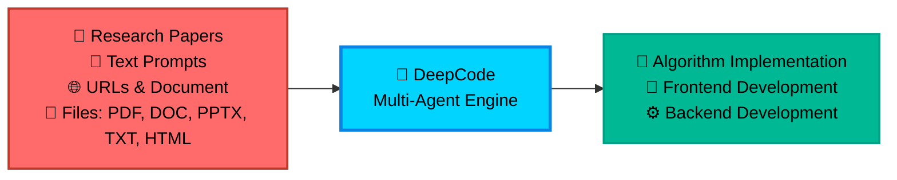

<div align="center">

<table style="border: none; margin: 0 auto; padding: 0; border-collapse: collapse;">
<tr>
<td align="center" style="vertical-align: middle; padding: 10px; border: none; width: 250px;">
  
</td>
<td align="left" style="vertical-align: middle; padding: 10px 0 10px 30px; border: none;">
  <pre style="font-family: 'Courier New', monospace; font-size: 16px; color: #0EA5E9; margin: 0; padding: 0; text-shadow: 0 0 10px #0EA5E9, 0 0 20px rgba(14,165,233,0.5); line-height: 1.2; transform: skew(-1deg, 0deg); display: block;">    ██████╗ ███████╗███████╗██████╗  ██████╗ ██████╗ ██████╗ ███████╗
    ██╔══██╗██╔════╝██╔════╝██╔══██╗██╔════╝██╔═══██╗██╔══██╗██╔════╝
    ██║  ██║█████╗  █████╗  ██████╔╝██║     ██║   ██║██║  ██║█████╗
    ██║  ██║██╔══╝  ██╔══╝  ██╔═══╝ ██║     ██║   ██║██║  ██║██╔══╝
    ██████╔╝███████╗███████╗██║     ╚██████╗╚██████╔╝██████╔╝███████╗
    ╚═════╝ ╚══════╝╚══════╝╚═╝      ╚═════╝ ╚═════╝ ╚═════╝ ╚══════╝</pre>
</td>
</tr>
</table>

<div align="center">
<a href="https://trendshift.io/repositories/14665" target="_blank"></a>
</div>

<!--  -->

#  DeepCode: Open Agentic Coding

### *Advancing Code Generation with Multi-Agent Systems*

<!-- <p align="center">
  

  
  
  
</p> -->
<p>
  <a href="https://github.com/HKUDS/DeepCode/stargazers"></a>
  <a href='https://arxiv.org/abs/2512.07921'></a>
  
  <!-- <a href="https://pypi.org/project/deepcode-hku/"></a> -->
</p>
<p>
  <a href="https://github.com/HKUDS/.github/blob/main/profile/README.md"></a>
  <a href="https://github.com/HKUDS/.github/blob/main/profile/README.md"></a>
</p>
<div align="center">
  <div style="width: 100%; height: 2px; margin: 20px 0; background: linear-gradient(90deg, transparent, #00d9ff, transparent);"></div>
</div>

<div align="center">
  <a href="#-quick-start" style="text-decoration: none;">
    
  </a>
</div>

<div align="center" style="margin-top: 10px;">
  <a href="README.md">
    
  </a>
  <a href="README_ZH.md">
    
  </a>
</div>

### 🖥️ **Interface Showcase**

<table align="center" width="100%" style="border: none; border-collapse: collapse; margin: 30px 0;">
<tr>
<td width="50%" align="center" style="vertical-align: top; padding: 20px;">

#### 🖥️ **CLI Interface**
**Terminal-Based Development**

<div align="center">

  

  <div style="background: linear-gradient(135deg, #2D3748 0%, #4A5568 100%); border-radius: 12px; padding: 15px; margin: 15px 0; color: white;">
    <strong>🚀 Advanced Terminal Experience</strong><br/>
    <small>⚡ Fast command-line workflow<br/>🔧 Developer-friendly interface<br/>📊 Real-time progress tracking</small>
  </div>

  *Professional terminal interface for advanced users and CI/CD integration*
</div>

</td>
<td width="50%" align="center" style="vertical-align: top; padding: 20px;">

#### 🌐 **Web Interface**
**Visual Interactive Experience**

<div align="center">

  

  <div style="background: linear-gradient(135deg, #0EA5E9 0%, #00D4FF 100%); border-radius: 12px; padding: 15px; margin: 15px 0; color: white;">
    <strong>🎨 Modern Web Dashboard</strong><br/>
    <small>🖱️ Intuitive drag-and-drop<br/>📱 Responsive design<br/>🎯 Visual progress tracking</small>
  </div>

  *Beautiful web interface with streamlined workflow for all skill levels*
</div>

</td>
</tr>
</table>

---

<div align="center">

### 🎬 **Introduction Video**

<div style="margin: 20px 0;">
  <a href="https://youtu.be/PRgmP8pOI08" target="_blank">
    
  </a>
</div>

*🎯 **Watch our complete introduction** - See how DeepCode transforms research papers and natural language into production-ready code*

<p>
  <a href="https://youtu.be/PRgmP8pOI08" target="_blank">
    
  </a>
</p>

</div>

---


> *"Where AI Agents Transform Ideas into Production-Ready Code"*

</div>

---

## 📑 Table of Contents

- [📰 News](#-news)
- [🚀 Key Features](#-key-features)
- [🏗️ Architecture](#️-architecture)
- [📊 Experimental Results](#-experimental-results)
- [🚀 Quick Start](#-quick-start)
- [💡 Examples](#-examples)
  - [🎬 Live Demonstrations](#-live-demonstrations)
- [⭐ Star History](#-star-history)
- [📄 License](#-license)


---

## 📰 News

**[2026-07-17] Extensible agents: reusable Skills, lifecycle Hooks & model-driven delegation**

- **The agent chooses how to work.** DeepCode can maintain a plan, ask a focused question when genuinely blocked, and load reusable `SKILL.md` playbooks only when needed. Project and user skills under `.deepcode/skills/` — plus existing `.claude/skills/` packages — work across the CLI, web chat, and headless runs.
- **Complex tasks delegate themselves.** The model can spawn bounded subagents with focused context, track their progress, and bring the results back into the parent task — without a special team command or a fixed workflow.
- **Plug in your own guardrails and automation.** External command hooks cover session start, prompt submission, tool use, permission decisions, stopping, and subagent lifecycle events. DeepCode reads native hook files as well as compatible `.claude/settings.json` configurations, with timeouts and validated outputs so a broken hook cannot hang the agent.
- **Run DeepCode from any folder.** `deepcode init` creates a user-level base under `~/.deepcode`; user configuration, instructions, and memory are layered with project overrides, so credentials stay global while repository-specific behavior follows the workspace. Configuration failures now show a clear setup hint instead of a traceback.

---

**[2026-07-10] Team mode: split a big feature across parallel workers**

- **A team, not just one agent.** Hand DeepCode a larger feature and it breaks the work into pieces, builds them at the same time, and combines the results — each piece checked against your tests as it goes.
- **Parallel work that never collides.** Every worker builds on its own isolated copy of your project, so simultaneous changes can't corrupt each other; when two pieces touch the same code, the overlap is flagged instead of silently overwritten.
- **Only ships when the tests pass.** Once everything is combined, the whole feature runs against your test command — the team reports success only when the tests are actually green.

---

**[2026-07-10] Loop engineering: give it a goal, it works until the tests pass**

- **Autonomous coding loops.** Hand DeepCode a goal and a test command — it works, runs your tests, and keeps fixing until they pass, on its own.
- **Self-tidying memory.** The agent periodically cleans up its own notes, so its memory stays sharp across sessions.
- **Run it on a schedule.** Kick off a loop or a memory tidy-up on an interval, with sensible stop conditions so it never runs away.

---

**[2026-07-08] Agent Chat, polished: memory, folder picker, session management**

- **The agent remembers across sessions.** Drop an `AGENTS.md` (or `DEEPCODE.md`) at your project root for standing instructions, and the agent keeps its own persistent notes under `.deepcode/memory/` — so a fact it learned yesterday is there today. Works the same in the CLI, the web chat, and headless runs.
- **Point it at a real project folder.** New chats get a workspace picker — browse and choose the directory the agent works in (fenced to your home), instead of typing a path blind.
- **Manage your conversations.** Rename or delete any chat from the sidebar; a new chat stays a draft until you send the first message, so the list no longer fills with empty sessions. Each chat's folder is shown and remembered across restarts.
- **Replies you can actually read.** Assistant messages render as markdown (code blocks, lists, tables); every tool call is an expandable card showing what it did (e.g. "Wrote 163 bytes to plan.md"); errors read as errors, not as a fake answer.

---

**[2026-07-08] General coding agent: interactive CLI, web Agent Chat & native tools**

- **Talk to DeepCode in your terminal.** `python -m cli.tui` (or just `deepcode`) opens a free-form, multi-turn coding conversation — describe any task in natural language and watch the agent stream its reply, edit files, and run commands with live progress cards. Steer with `/new`, `/resume`, `/model`, `/clear`, `/help`, and attach files with `@path`. (Replaces the previous menu-driven CLI.)
- **Chat with the agent in your browser.** The new "Agent Chat" page keeps continuous conversations: a sidebar of past chats, one-click New chat, streamed replies with tool progress, and mid-run interrupt. Every chat persists, reopens any time, and works in its own workspace under `deepcode_lab/chats/`.
- **Edits that land on the first try.** First-class `read` / `write` / `edit` / `apply_patch` / `bash` / `grep` / `glob` tools: whitespace-tolerant fuzzy edits, multi-file atomic patches, and automatic post-edit diagnostics the agent fixes on the spot.
- **Script any task.** `python -m cli.exec_cli "task" --json` runs one task end-to-end and emits a machine-readable event stream — drop it straight into CI or your own pipelines.
- **Long conversations stay fast and stable.** Context windows resolve per model with automatic history compaction, and sessions are SQLite-indexed so listing and resume are instant.

---

**[2026-07-04] V2 foundation: unified agent kernel, security sandbox & event protocol**

- **Every coding phase behaves the same.** All phases now run on one shared agent runtime, with tool definitions sourced straight from the MCP servers as the single source of truth — Paper2Code results unchanged.
- **Your credentials stay yours.** Every tool call passes a three-valued permission engine (allow / ask / deny) with a non-overridable credential denylist (`.ssh`, `.aws/credentials`, `.env`, `*.pem`, ...), and shell/Python execution runs inside a platform sandbox (macOS seatbelt / Linux bubblewrap) fenced to the workspace. Tune it via `DEEPCODE_SANDBOX` / `DEEPCODE_PERMISSION_MODE` or the `security` block in `deepcode_config.json`.
- **Build any frontend on one contract.** Declarative per-model provider settings, a normalized model-event stream, a structured message model, and an `AgentSession` event protocol back the CLI, the web UI, and headless runs alike.
- **Web chat planning just runs.** It now proceeds autonomously by default (requirements -> plan -> implementation) instead of stalling on a clarifying-questions step.

---

<details>
<summary><strong>Earlier news</strong></summary>

🧭 **[2026-05-01] OpenRouter model selector, session cleanup & workflow UX hardening**

- 🧠 **OpenRouter model catalog in Settings.** The new UI can now fetch OpenRouter model metadata from `https://openrouter.ai/api/v1/models`, cache it locally, and expose searchable model selectors for the Default, Planning, and Implementation phases. Use exact OpenRouter model ids such as `z-ai/glm-5.1` without editing JSON by hand.
- 🔄 **Runtime model switching.** Saving model choices from Settings updates `deepcode_config.json` and reloads the in-process LLM runtime so newly started workflows pick up the selected provider/model combination immediately.
- 🗑️ **Session deletion now performs safe cascade cleanup.** Deleting a session from the UI removes its persistent session store and associated `deepcode_lab/tasks/<task_id>/` workspaces, while preserving shared `uploads/` source files. Sessions with `pending`, `running`, or `waiting_for_input` tasks are blocked with a clear `409 Conflict`.
- 📊 **More accurate Paper2Code progress.** The frontend now shows backend stage messages and avoids marking intermediate phases as fully "Done" while long LLM work is still running.
- 🛡️ **Workflow robustness fixes.** Uploads now reject Git LFS pointer files, cancelled tasks stop backend work promptly, stale browser session ids recover cleanly, planner retries fall back to a minimal valid plan when a model defers/tool-calls incorrectly, and document segmentation skips an extra validation LLM call that could stall progress.

---

🗂️ **[2026-04-28] Persistent sessions & dual-layer logging**

- 🆕 **Sessions are now persistent.** Every CLI / UI run is automatically attached to a session under `~/.deepcode/sessions/<id>/` (override with `DEEPCODE_SESSIONS_DIR`). Sessions are JSONL — `tail -f session.jsonl` works out of the box. List / inspect / branch them with `python cli/main_cli.py session list|show <id>|new|resume <id>|delete <id>`, or via `GET /api/v1/sessions` from the backend.
- 🔄 **Resume a previous run** by passing `--session <id>` to the CLI or `session_id` to `POST /api/v1/workflows/paper-to-code` (or `chat-planning`). Backend restarts no longer drop task history; running tasks left over from a crash are surfaced as `interrupted`.
- 💻 **CLI session UX.** The interactive CLI now supports Cursor-style slash commands: `/resume` opens a numbered session picker, `/new [title]` creates and switches sessions, `/session` shows the active session, and `/help` lists commands. You can also paste inline inputs directly at the menu prompt with `@/path/to/paper.pdf`, `@"C:\path with spaces\paper.pdf"`, or `@https://...`.
- 📜 **Two-layer structured logging.** A global rotating JSONL lives at `logs/server-YYYYMMDD.jsonl`; per-task logs at `deepcode_lab/tasks/<task_id>/logs/{system,llm,mcp}.jsonl`. Every `loguru.logger` call automatically picks up the active `task_id` via a contextvar — business code did not have to change. Configure via the new `logger.{globalFile,taskFile,llm}` block in `deepcode_config.json`.
- 📡 **WebSocket log streaming.** Tail one task with `/ws/tasks/{task_id}/logs?channel=llm`, or merge every task in a session via `/ws/sessions/{session_id}/logs`. The legacy `/ws/logs/{session_id}` endpoint that silently ignored its parameter has been removed.
- 🧹 **Dead code removed.** `utils/simple_llm_logger.py`, `utils/dialogue_logger.py`, and the in-memory `services/session_service.py` implementation are gone (the latter is now a thin re-export of `core.sessions.SessionStore`).

---

🛠️ **[2026-04-17] Stability, Windows compatibility & secrets hygiene update**

- 🐛 **Code Implementation no longer crashes** with `name 'LoopDetector' is not defined` — added the missing `LoopDetector`/`ProgressTracker` imports in both `workflows/code_implementation_workflow.py` and `workflows/code_implementation_workflow_index.py`.
- 🪟 **Windows: `mkdir -p` / `touch` / `rm -rf` / `cp -r` / `mv` now work natively.** `tools/command_executor.py` translates these common Unix file-tree commands via `pathlib`/`shutil` on every platform, eliminating the bug where `cmd.exe` would create a literal `-p` directory and stall the workflow.
- 🚀 **Removed Brave Search end-to-end.** All Python code, MCP server config, and docs are scrubbed of `brave`/`BRAVE_API_KEY`/`WebSearchTool`. Web fetching now relies entirely on the built-in `fetch` MCP server.
- 🔌 **OpenAI-compatible providers documented.** New `Quick Start → Configuration` snippet shows how to point the `openai`/`openrouter` blocks at Poe (`https://api.poe.com/v1`), OpenRouter, or Alibaba DashScope, plus how to set `agents.defaults.model` / `agents.planning.model` / `agents.implementation.model` (e.g. `openai/gpt-5.4`).
- 🔐 **Secrets hygiene.** All YAML config has been collapsed into a single `deepcode_config.json`, and `.gitignore` now ignores it alongside `secrets.json`, `*credentials*.json`, `.env`, `.env.*` (with `*.env.example` whitelisted).
- 📝 **Launch table fixed.** The README now documents `deepcode --local` for the web UI path and adds explicit Troubleshooting rows for Windows GBK encoding and the issues fixed above.
- 🧹 **Misc:** auto-create `logs/` directory so JSONL logging never fails on a fresh checkout, replace bare `except:` with `except Exception:` in `agent_orchestration_engine.py` (Ruff E722), `command_executor` MCP tool descriptions now embed the host OS so the LLM picks compatible commands.

---

🎉 **[2026-02] New Web UI Experience Upgrade!**

- 🔄 **User-in-Loop Interaction**: Support real-time user interaction during workflows - AI asks clarifying questions directly in the chat
- 💬 **Inline Interaction Design**: Interaction prompts appear naturally within the chat flow for a seamless experience
- 🚀 **One-Click Launch**: Simply run `deepcode` to start the new UI (cross-platform: Windows/macOS/Linux)
- 🔧 **Improved Process Management**: Enhanced service start/stop mechanism with automatic port cleanup
- 📡 **WebSocket Real-time Communication**: Fixed message loss issues, ensuring proper interaction state synchronization

<div align="center">
  
  <br/>
  <sub><em>DeepCode New Web UI - Modern React-based Interface</em></sub>
</div>

---

🎉 **[2025-10-28] DeepCode Achieves SOTA on PaperBench!**

DeepCode sets new benchmarks on OpenAI's PaperBench Code-Dev across all categories:

- 🏆 **Surpasses Human Experts**: **75.9%** (DeepCode) vs Top Machine Learning PhDs 72.4% (+3.5%).
- 🥇 **Outperforms SOTA Commercial Code Agents**: **84.8%** (DeepCode) vs Leading Commercial Code Agents (+26.1%) (Cursor, Claude Code, and Codex).
- 🔬 **Advances Scientific Coding**: **73.5%** (DeepCode) vs PaperCoder 51.1% (+22.4%).
- 🚀 **Beats LLM Agents**: **73.5%** (DeepCode) vs best LLM frameworks 43.3% (+30.2%).

</details>

---

## 🚀 Key Features

<br/>

<table align="center" width="100%" style="border: none; table-layout: fixed;">
<tr>
<td width="30%" align="center" style="vertical-align: top; padding: 20px;">

<div style="height: 80px; display: flex; align-items: center; justify-content: center;">
<h3 style="margin: 0; padding: 0;">🚀 <strong>Paper2Code</strong></h3>
</div>

<div align="center" style="margin: 15px 0;">
  
</div>

<div style="height: 80px; display: flex; align-items: center; justify-content: center;">
<p align="center"><strong>Automated Implementation of Complex Algorithms</strong></p>
</div>

<div style="height: 60px; display: flex; align-items: center; justify-content: center;">
<p align="center">Effortlessly converts complex algorithms from research papers into <strong>high-quality</strong>, <strong>production-ready</strong> code, accelerating algorithm reproduction.</p>
</div>


</td>
<td width="30%" align="center" style="vertical-align: top; padding: 20px;">

<div style="height: 80px; display: flex; align-items: center; justify-content: center;">
<h3 style="margin: 0; padding: 0;">🎨 <strong>Text2Web</strong></h3>
</div>

<div align="center" style="margin: 15px 0;">
  
</div>

<div style="height: 80px; display: flex; align-items: center; justify-content: center;">
<p align="center"><strong>Automated Front-End Web Development</strong></p>
</div>

<div style="height: 60px; display: flex; align-items: center; justify-content: center;">
<p align="center">Translates plain textual descriptions into <strong>fully functional</strong>, <strong>visually appealing</strong> front-end web code for rapid interface creation.</p>
</div>


</td>
<td width="30%" align="center" style="vertical-align: top; padding: 20px;">

<div style="height: 80px; display: flex; align-items: center; justify-content: center;">
<h3 style="margin: 0; padding: 0;">⚙️ <strong>Text2Backend</strong></h3>
</div>

<div align="center" style="margin: 15px 0;">
  
</div>

<div style="height: 80px; display: flex; align-items: center; justify-content: center;">
<p align="center"><strong>Automated Back-End Development</strong></p>
</div>

<div style="height: 60px; display: flex; align-items: center; justify-content: center;">
<p align="center">Generates <strong>efficient</strong>, <strong>scalable</strong>, and <strong>feature-rich</strong> back-end code from simple text inputs, streamlining server-side development.</p>
</div>


</td>
</tr>
</table>

<br/>

---

## 📊 Experimental Results

<div align="center">
    <br>
</div>
<br/>

We evaluate **DeepCode** on the [*PaperBench*](https://openai.com/index/paperbench/) benchmark (released by OpenAI), a rigorous testbed requiring AI agents to independently reproduce 20 ICML 2024 papers from scratch. The benchmark comprises 8,316 gradable components assessed using SimpleJudge with hierarchical weighting.

Our experiments compare DeepCode against four baseline categories: **(1) Human Experts**, **(2) State-of-the-Art Commercial Code Agents**, **(3) Scientific Code Agents**, and **(4) LLM-Based Agents**.

### ① 🧠 Human Expert Performance (Top Machine Learning PhD)

**DeepCode: 75.9% vs. Top Machine Learning PhD: 72.4% (+3.5%)**

DeepCode achieves **75.9%** on the 3-paper human evaluation subset, **surpassing the best-of-3 human expert baseline (72.4%) by +3.5 percentage points**. This demonstrates that our framework not only matches but exceeds expert-level code reproduction capabilities, representing a significant milestone in autonomous scientific software engineering.

### ② 💼 State-of-the-Art Commercial Code Agents

**DeepCode: 84.8% vs. Best Commercial Agent: 58.7% (+26.1%)**

On the 5-paper subset, DeepCode substantially outperforms leading commercial coding tools:
- Cursor: 58.4%
- Claude Code: 58.7%
- Codex: 40.0%
- **DeepCode: 84.8%**

This represents a **+26.1% improvement** over the leading commercial code agent. All commercial agents utilize Claude Sonnet 4.5 or GPT-5 Codex-high, highlighting that **DeepCode's superior architecture**—rather than base model capability—drives this performance gap.

### ③ 🔬 Scientific Code Agents

**DeepCode: 73.5% vs. PaperCoder: 51.1% (+22.4%)**

Compared to PaperCoder (**51.1%**), the state-of-the-art scientific code reproduction framework, DeepCode achieves **73.5%**, demonstrating a **+22.4% relative improvement**. This substantial margin validates our multi-module architecture combining planning, hierarchical task decomposition, code generation, and iterative debugging over simpler pipeline-based approaches.

### ④ 🤖 LLM-Based Agents

**DeepCode: 73.5% vs. Best LLM Agent: 43.3% (+30.2%)**

DeepCode significantly outperforms all tested LLM agents:
- Claude 3.5 Sonnet + IterativeAgent: 27.5%
- o1 + IterativeAgent (36 hours): 42.4%
- o1 BasicAgent: 43.3%
- **DeepCode: 73.5%**

The **+30.2% improvement** over the best-performing LLM agent demonstrates that sophisticated agent scaffolding, rather than extended inference time or larger models, is critical for complex code reproduction tasks.

---

### 🎯 **Autonomous Self-Orchestrating Multi-Agent Architecture**

**The Challenges**:

- 📄 **Implementation Complexity**: Converting academic papers and complex algorithms into working code requires significant technical effort and domain expertise

- 🔬 **Research Bottleneck**: Researchers spend valuable time implementing algorithms instead of focusing on their core research and discovery work

- ⏱️ **Development Delays**: Product teams experience long wait times between concept and testable prototypes, slowing down innovation cycles

- 🔄 **Repetitive Coding**: Developers repeatedly implement similar patterns and functionality instead of building on existing solutions

**DeepCode** addresses these workflow inefficiencies by providing reliable automation for common development tasks, streamlining your development workflow from concept to code.

<div align="center">



</div>

---

## 🏗️ Architecture

### 📊 **System Overview**

**DeepCode** is an AI-powered development platform that automates code generation and implementation tasks. Our multi-agent system handles the complexity of translating requirements into functional, well-structured code, allowing you to focus on innovation rather than implementation details.

🎯 **Technical Capabilities**:

🧬 **Research-to-Production Pipeline**<br>
Multi-modal document analysis engine that extracts algorithmic logic and mathematical models from academic papers. Generates optimized implementations with proper data structures while preserving computational complexity characteristics.

🪄 **Natural Language Code Synthesis**<br>
Context-aware code generation using fine-tuned language models trained on curated code repositories. Maintains architectural consistency across modules while supporting multiple programming languages and frameworks.

⚡ **Automated Prototyping Engine**<br>
Intelligent scaffolding system generating complete application structures including database schemas, API endpoints, and frontend components. Uses dependency analysis to ensure scalable architecture from initial generation.

💎 **Quality Assurance Automation**<br>
Integrated static analysis with automated unit test generation and documentation synthesis. Employs AST analysis for code correctness and property-based testing for comprehensive coverage.

🔮 **CodeRAG Integration System**<br>
Advanced retrieval-augmented generation combining semantic vector embeddings with graph-based dependency analysis. Automatically discovers optimal libraries and implementation patterns from large-scale code corpus.

---

### 🔧 **Core Techniques**

- 🧠 **Intelligent Orchestration Agent**: Central decision-making system that coordinates workflow phases and analyzes requirements. Employs dynamic planning algorithms to adapt execution strategies in real-time based on evolving project complexity. Dynamically selects optimal processing strategies for each implementation step. <br>

- 💾 **Efficient Memory Mechanism**: Advanced context engineering system that manages large-scale code contexts efficiently. Implements hierarchical memory structures with intelligent compression for handling complex codebases. This component enables instant retrieval of implementation patterns and maintains semantic coherence across extended development sessions. <br>

- 🔍 **Advanced CodeRAG System**: Global code comprehension engine that analyzes complex inter-dependencies across repositories. Performs cross-codebase relationship mapping to understand architectural patterns from a holistic perspective. This module leverages dependency graphs and semantic analysis to provide globally-aware code recommendations during implementation.

---

### 🤖 **Multi-Agent Architecture of DeepCode**:

- **🎯 Central Orchestrating Agent**: Orchestrates entire workflow execution and makes strategic decisions. Coordinates specialized agents based on input complexity analysis. Implements dynamic task planning and resource allocation algorithms. <br>

- **📝 Intent Understanding Agent**: Performs deep semantic analysis of user requirements to decode complex intentions. Extracts functional specifications and technical constraints through advanced NLP processing. Transforms ambiguous human descriptions into precise, actionable development specifications with structured task decomposition. <br>

- **📄 Document Parsing Agent**: Processes complex technical documents and research papers with advanced parsing capabilities. Extracts algorithms and methodologies using document understanding models. Converts academic concepts into practical implementation specifications through intelligent content analysis. <br>

- **🏗️ Code Planning Agent**: Performs architectural design and technology stack optimization. Dynamic planning for adaptive development roadmaps. Enforces coding standards and generates modular structures through automated design pattern selection.<br>

- **🔍 Code Reference Mining Agent**: Discovers relevant repositories and frameworks through intelligent search algorithms. Analyzes codebases for compatibility and integration potential. Provides recommendations based on similarity metrics and automated dependency analysis. <br>

- **📚 Code Indexing Agent**: Builds comprehensive knowledge graphs of discovered codebases. Maintains semantic relationships between code components. Enables intelligent retrieval and cross-reference capabilities. <br>

- **🧬 Code Generation Agent**: Synthesizes gathered information into executable code implementations. Creates functional interfaces and integrates discovered components. Generates comprehensive test suites and documentation for reproducibility.

---

#### 🛠️ **Implementation Tools Matrix**

**🔧 Powered by MCP (Model Context Protocol)**

DeepCode leverages the **Model Context Protocol (MCP)** standard to seamlessly integrate with various tools and services. This standardized approach ensures reliable communication between AI agents and external systems, enabling powerful automation capabilities.

##### 📡 **MCP Servers & Tools**

| 🛠️ **MCP Server** | 🔧 **Primary Function** | 💡 **Purpose & Capabilities** |
|-------------------|-------------------------|-------------------------------|
| **📂 filesystem** | File System Operations | Local file and directory management, read/write operations |
| **🌐 fetch** | Web Content Retrieval | Fetch and extract content from URLs and web resources |
| **📥 github-downloader** | Repository Management | Clone and download GitHub repositories for analysis |
| **📋 file-downloader** | Document Processing | Download and convert files (PDF, DOCX, etc.) to Markdown |
| **⚡ command-executor** | System Commands | Execute bash/shell commands for environment management |
| **🧬 code-implementation** | Code Generation Hub | Comprehensive code reproduction with execution and testing |
| **📚 code-reference-indexer** | Smart Code Search | Intelligent indexing and search of code repositories |
| **📄 document-segmentation** | Smart Document Analysis | Intelligent document segmentation for large papers and technical documents |

##### 🔧 **Legacy Tool Functions** *(for reference)*

| 🛠️ **Function** | 🎯 **Usage Context** |
|-----------------|---------------------|
| **📄 read_code_mem** | Efficient code context retrieval from memory |
| **✍️ write_file** | Direct file content generation and modification |
| **🐍 execute_python** | Python code testing and validation |
| **📁 get_file_structure** | Project structure analysis and organization |
| **⚙️ set_workspace** | Dynamic workspace and environment configuration |
| **📊 get_operation_history** | Process monitoring and operation tracking |


---

🎛️ **Multi-Interface Framework**<br>
RESTful API with CLI and web frontends featuring real-time code streaming, interactive debugging, and extensible plugin architecture for CI/CD integration.

**🚀 Multi-Agent Intelligent Pipeline:**

<div align="center">

### 🌟 **Intelligence Processing Flow**

<table align="center" width="100%" style="border: none; border-collapse: collapse;">
<tr>
<td colspan="3" align="center" style="padding: 20px; background: linear-gradient(135deg, #667eea 0%, #764ba2 100%); border-radius: 15px; color: white; font-weight: bold;">
💡 <strong>INPUT LAYER</strong><br/>
📄 Research Papers • 💬 Natural Language • 🌐 URLs • 📋 Requirements
</td>
</tr>
<tr><td colspan="3" height="20"></td></tr>
<tr>
<td colspan="3" align="center" style="padding: 15px; background: linear-gradient(135deg, #ff6b6b 0%, #ee5a24 100%); border-radius: 12px; color: white; font-weight: bold;">
🎯 <strong>CENTRAL ORCHESTRATION</strong><br/>
Strategic Decision Making • Workflow Coordination • Agent Management
</td>
</tr>
<tr><td colspan="3" height="15"></td></tr>
<tr>
<td align="center" style="padding: 12px; background: linear-gradient(135deg, #3742fa 0%, #2f3542 100%); border-radius: 10px; color: white; width: 50%;">
📝 <strong>TEXT ANALYSIS</strong><br/>
<small>Requirement Processing</small>
</td>
<td width="10"></td>
<td align="center" style="padding: 12px; background: linear-gradient(135deg, #8c7ae6 0%, #9c88ff 100%); border-radius: 10px; color: white; width: 50%;">
📄 <strong>DOCUMENT ANALYSIS</strong><br/>
<small>Paper & Spec Processing</small>
</td>
</tr>
<tr><td colspan="3" height="15"></td></tr>
<tr>
<td colspan="3" align="center" style="padding: 15px; background: linear-gradient(135deg, #00d2d3 0%, #54a0ff 100%); border-radius: 12px; color: white; font-weight: bold;">
📋 <strong>REPRODUCTION PLANNING</strong><br/>
Deep Paper Analysis • Code Requirements Parsing • Reproduction Strategy Development
</td>
</tr>
<tr><td colspan="3" height="15"></td></tr>
<tr>
<td align="center" style="padding: 12px; background: linear-gradient(135deg, #ffa726 0%, #ff7043 100%); border-radius: 10px; color: white; width: 50%;">
🔍 <strong>REFERENCE ANALYSIS</strong><br/>
<small>Repository Discovery</small>
</td>
<td width="10"></td>
<td align="center" style="padding: 12px; background: linear-gradient(135deg, #e056fd 0%, #f368e0 100%); border-radius: 10px; color: white; width: 50%;">
📚 <strong>CODE INDEXING</strong><br/>
<small>Knowledge Graph Building</small>
</td>
</tr>
<tr><td colspan="3" height="15"></td></tr>
<tr>
<td colspan="3" align="center" style="padding: 15px; background: linear-gradient(135deg, #26de81 0%, #20bf6b 100%); border-radius: 12px; color: white; font-weight: bold;">
🧬 <strong>CODE IMPLEMENTATION</strong><br/>
Implementation Generation • Testing • Documentation
</td>
</tr>
<tr><td colspan="3" height="15"></td></tr>
<tr>
<td colspan="3" align="center" style="padding: 20px; background: linear-gradient(135deg, #045de9 0%, #09c6f9 100%); border-radius: 15px; color: white; font-weight: bold;">
⚡ <strong>OUTPUT DELIVERY</strong><br/>
📦 Complete Codebase • 🧪 Test Suite • 📚 Documentation • 🚀 Deployment Ready
</td>
</tr>
</table>

</div>

<div align="center">
<br/>

### 🔄 **Process Intelligence Features**

<table align="center" style="border: none;">
<tr>
<td align="center" width="25%" style="padding: 15px;">
<div style="background: #f8f9fa; border-radius: 10px; padding: 15px; border-left: 4px solid #ff6b6b;">
<h4>🎯 Adaptive Flow</h4>
<p><small>Dynamic agent selection based on input complexity</small></p>
</div>
</td>
<td align="center" width="25%" style="padding: 15px;">
<div style="background: #f8f9fa; border-radius: 10px; padding: 15px; border-left: 4px solid #4ecdc4;">
<h4>🧠 Smart Coordination</h4>
<p><small>Intelligent task distribution and parallel processing</small></p>
</div>
</td>
<td align="center" width="25%" style="padding: 15px;">
<div style="background: #f8f9fa; border-radius: 10px; padding: 15px; border-left: 4px solid #45b7d1;">
<h4>🔍 Context Awareness</h4>
<p><small>Deep understanding through CodeRAG integration</small></p>
</div>
</td>
<td align="center" width="25%" style="padding: 15px;">
<div style="background: #f8f9fa; border-radius: 10px; padding: 15px; border-left: 4px solid #96ceb4;">
<h4>⚡ Quality Assurance</h4>
<p><small>Automated testing and validation throughout</small></p>
</div>
</td>
</tr>
</table>

</div>

---


## 🚀 Quick Start

### 📋 **Prerequisites**

Before installing DeepCode, ensure you have the following:

| Requirement | Version | Purpose |
|-------------|---------|---------|
| **Python** | 3.9+ | Core runtime |
| **Node.js** | 18+ | New UI frontend |
| **npm** | 8+ | Package management |

```bash
# Check your versions
python --version   # Should be 3.9+
node --version     # Should be 18+
npm --version      # Should be 8+
```

<details>
<summary><strong>📥 Install Node.js (if not installed)</strong></summary>

```bash
# macOS (using Homebrew)
brew install node

# Ubuntu/Debian
curl -fsSL https://deb.nodesource.com/setup_20.x | sudo -E bash -
sudo apt-get install -y nodejs

# Windows
# Download from https://nodejs.org/
```

</details>

### 📦 **Step 1: Installation**

Choose one of the following installation methods:

#### ⚡ **Direct Installation (Recommended)**

```bash
# 🚀 Install DeepCode package directly
pip install deepcode-hku

# 🔑 One-time setup: create ~/.deepcode/deepcode_config.json (then add a key)
deepcode init
```

#### 🔧 **Development Installation (From Source)**

<details>
<summary><strong>📂 Click to expand development installation options</strong></summary>

##### 🔥 **Using UV (Recommended for Development)**

```bash
git clone https://github.com/HKUDS/DeepCode.git
cd DeepCode/

curl -LsSf https://astral.sh/uv/install.sh | sh
uv venv --python=3.13
source .venv/bin/activate  # On Windows: .venv\Scripts\activate
uv pip install -r requirements.txt

# Install frontend dependencies
npm install --prefix new_ui/frontend
```

##### 🐍 **Using Traditional pip**

```bash
git clone https://github.com/HKUDS/DeepCode.git
cd DeepCode/

pip install -r requirements.txt

# Install frontend dependencies
npm install --prefix new_ui/frontend
```

##### 🧪 **Editable install (lets `deepcode` always run THIS checkout)**

If you want the global `deepcode` command to launch the source tree you are
hacking on, install the project in editable mode after the steps above:

```bash
pip install -e .
```

This registers a `deepcode-hku` package (current version 1.2.0) and exposes
the `deepcode` CLI entry point. Any local code change is picked up
immediately on next launch — no reinstall needed.

> If you maintain multiple DeepCode checkouts, only one of them can own the
> `deepcode` command at a time (the most recent `pip install -e .` wins).
> Reinstall in the checkout you currently want to be active.

</details>

### 🔧 **Step 2: Configuration**

> The following configuration applies to **all installation methods** (pip, UV, source). Everything lives in a single `deepcode_config.json` file.

#### 🌍 Run `deepcode` from any directory

DeepCode resolves its config in two layers, the same way Codex and Claude Code do:

| Layer | Location | Role |
|-------|----------|------|
| **User base** | `~/.deepcode/deepcode_config.json` (or `$DEEPCODE_HOME`) | Read from **any** working directory. Keep your provider keys here. |
| **Project override** | `deepcode_config.json` in the current directory (or any parent) | Optional. Deep-merged on top of the base, overriding it key by key. |

Run the one-time setup and you can launch `deepcode` anywhere:

```bash
deepcode init      # creates ~/.deepcode/deepcode_config.json
```

`deepcode init` is a single cross-platform command (Windows, macOS, Linux). Run
from a checkout that already has a `deepcode_config.json`, it lifts that config —
keys and all — into the user base; run elsewhere, it drops the template there for
you to fill in. It never overwrites an existing base (use `--force` to reseed,
which keeps a `.bak`), and on Unix it locks the file to `600`. To relocate the
base, set `DEEPCODE_HOME` (`export DEEPCODE_HOME=...` on macOS/Linux,
`setx DEEPCODE_HOME ...` on Windows).

> If you prefer to keep the config only next to a specific project, skip
> `deepcode init` and just create `deepcode_config.json` in that directory — it
> is picked up whenever you launch from there.

#### 🔑 API Keys *(required)*

Edit `deepcode_config.json` and fill in at least one provider key. Inline strings work, and `${ENV_VAR}` references are resolved at load time.

```json
{
  "providers": {
    "openai":    { "apiKey": "your_openai_api_key" },
    "anthropic": { "apiKey": "${ANTHROPIC_API_KEY}" },
    "gemini":    { "apiKey": "" }
  }
}
```

<details>
<summary><strong>🔌 Using OpenAI-compatible providers (OpenRouter / Poe / DashScope / etc.)</strong></summary>

Any OpenAI-compatible endpoint is supported by overriding `apiBase` on the matching provider entry. Then set the model name on the `agents` block (using `provider/model` slugs):

```json
{
  "agents": {
    "defaults": {
      "provider": "openrouter",
      "model": "z-ai/glm-5.1"
    },
    "planning":       { "provider": "openrouter", "model": "z-ai/glm-5.1" },
    "implementation": { "provider": "openrouter", "model": "z-ai/glm-5.1" }
  },
  "providers": {
    "openai":     { "apiKey": "your_openai_api_key" },
    "openrouter": { "apiKey": "your_openrouter_key", "apiBase": "https://openrouter.ai/api/v1" }
  }
}
```

OpenRouter model ids must use the exact `id` returned by OpenRouter, for example
`z-ai/glm-5.1`, `anthropic/claude-sonnet-4.5`, or
`google/gemini-2.5-pro`. In the new UI, open **Settings → OpenRouter Models**
to search the live OpenRouter catalog and update the Default, Planning, and
Implementation models without editing this file manually. Saving from the UI
reloads the runtime for newly started workflows.

> **🔐 Never commit `deepcode_config.json`.** It is already in `.gitignore`.

</details>

#### 🤖 LLM Provider *(optional)*

The provider is inferred from the `model` slug (`openai/...`, `anthropic/...`, `gemini/...`, etc.). To force a specific backend, set `agents.defaults.provider`:

```json
{
  "agents": {
    "defaults": { "provider": "openai" }
  }
}
```

#### 📄 Document Segmentation *(optional)*

```json
{
  "documentSegmentation": {
    "enabled": true,
    "sizeThresholdChars": 50000
  }
}
```

<details>
<summary><strong>🪟 Windows Users: Additional MCP Server Configuration</strong></summary>

On Windows you may need to configure MCP servers manually in `deepcode_config.json` (`tools.mcpServers`):

```bash
# 1. Install MCP servers globally
npm i -g @modelcontextprotocol/server-filesystem

# 2. Find your global node_modules path
npm -g root
```

```json
{
  "tools": {
    "mcpServers": {
      "filesystem": {
        "type": "stdio",
        "command": "node",
        "args": ["C:/Program Files/nodejs/node_modules/@modelcontextprotocol/server-filesystem/dist/index.js", "."]
      }
    }
  }
}
```

> Replace the path with the actual global `node_modules` path from step 2.

</details>

<details>
<summary><strong>🔍 Web Search Configuration</strong></summary>

DeepCode performs web content retrieval through the built-in `fetch` MCP server (no API key required) and reads local files via `filesystem`. The auxiliary search server defaults to `filesystem`:

```json
{
  "tools": { "defaultSearchServer": "filesystem" }
}
```

> **💡 Tip**: To plug in another search backend, add it under `tools.mcpServers` in `deepcode_config.json` and set `tools.defaultSearchServer` to its name.

</details>

### ⚡ **Step 3: Launch Application**

DeepCode runs three ways, all on the same agent core:

**🖥️ Interactive agent (default).** A multi-turn coding conversation in your terminal:

```bash
deepcode                 # equivalent to: python -m cli.tui
```

**🌐 Local web UI.** React frontend + FastAPI backend on your host:

```bash
deepcode --local
# Frontend → http://localhost:5173    Backend → http://localhost:8000
```

**🤖 Headless (scripting / CI).** One task, machine-readable output:

```bash
python -m cli.exec_cli "fix the failing test in mathlib.py" --json
```

#### 💻 **Interactive CLI (multi-turn coding agent)**

`python -m cli.tui` opens a Claude Code-style conversation in your terminal:
describe any coding task in natural language, watch the agent stream its
reply and tool progress live, and keep the conversation going across turns.

```bash
python -m cli.tui                          # converse in the current directory
python -m cli.tui -w ./my-project          # explicit workspace
python -m cli.tui -m gpt-5.4               # explicit model
python -m cli.tui --resume <session_id>    # pick up a stored conversation
```

Inside the conversation:

```text
/help                   # list all commands
/new [title]            # start a fresh conversation
/resume                 # list THIS directory's sessions; /resume <id> restores one
/resume all             # list sessions from every directory (origins shown)
/model [id]             # show or switch the model (history preserved)
/clear                  # clear the conversation context
@src/main.py            # attach a file's content to your message
```

Conversations persist under `~/.deepcode/sessions/<id>/` (JSONL, with a SQLite
index for instant listing) and are titled automatically from your first
message.

For scripting and CI there is a headless one-shot entry:

```bash
python -m cli.exec_cli "fix the failing test in mathlib.py" --json
```

which streams machine-readable events (NDJSON) and exits 0 on completion.

In the web UI, use the **Sessions** menu in the header to resume or delete a
session. Deleting a session removes its JSONL session record and associated task
workspace under `deepcode_lab/tasks/`, but keeps original files in `uploads/`.
If the session still has `pending`, `running`, or `waiting_for_input` tasks, the
backend rejects the deletion until the task is cancelled or completed.

### 🎯 **Step 4: Generate Code**

1. **📄 Input** — Upload a research paper, type requirements, or paste a URL
2. **🤖 Processing** — The multi-agent system analyzes, plans, and generates
3. **⚡ Output** — Receive production-ready code with tests and documentation

---

### 🔧 **Troubleshooting**

<details>
<summary><strong>❓ Common Issues & Solutions</strong></summary>

| Problem | Cause | Fix |
|---|---|---|
| Frontend blank page | Corrupted `node_modules` | `cd new_ui/frontend && rm -rf node_modules && npm install` |
| `ERR_CONNECTION_REFUSED` | Wrong port / backend not running | With `--local`: frontend `http://localhost:5173`, backend `http://localhost:8000` |
| `npm install` → `Could not read package.json` | Wrong directory | Use `npm install --prefix new_ui/frontend` |
| Windows: MCP servers not working | Need absolute paths | See [Windows MCP Configuration](#-step-2-configuration) above |
| Windows: `UnicodeEncodeError: 'gbk' codec can't encode...` on launch | Default GBK console can't render emoji in startup banner | Set UTF-8 first: `set PYTHONIOENCODING=utf-8 && set PYTHONUTF8=1` (cmd) or `$env:PYTHONIOENCODING="utf-8"; $env:PYTHONUTF8="1"` (PowerShell) |
| Windows: code-implementation stage hangs / produces a `-p` directory | LLM emitted `mkdir -p ...` and `cmd.exe` treated `-p` as a folder name | Already fixed in `tools/command_executor.py` — common Unix commands (`mkdir -p`, `touch`, `rm -rf`, `cp -r`, `mv`) are now executed natively via `pathlib`/`shutil`, no shell needed |
| `name 'LoopDetector' is not defined` during code implementation | Missing import in workflow modules | Already fixed — `LoopDetector` and `ProgressTracker` are now imported from `utils.loop_detector` in both `workflows/code_implementation_workflow.py` and `workflows/code_implementation_workflow_index.py` |

</details>

  ---

## 💡 Examples


### 🎬 **Live Demonstrations**


<table align="center">
<tr>
<td width="33%" align="center">

#### 📄 **Paper2Code Demo**
**Research to Implementation**

<div align="center">
  <a href="https://www.youtube.com/watch?v=MQZYpLkzsbw">
    
  </a>

  **[▶️ Watch Demo](https://www.youtube.com/watch?v=MQZYpLkzsbw)**

  *Transform academic papers into production-ready code automatically*
</div>

</td>
<td width="33%" align="center">

#### 🖼️ **Image Processing Demo**
**AI-Powered Image Tools**

<div align="center">
  <a href="https://www.youtube.com/watch?v=nFt5mLaMEac">
    
  </a>

  **[▶️ Watch Demo](https://www.youtube.com/watch?v=nFt5mLaMEac)**

  *Intelligent image processing with background removal and enhancement*
</div>

</td>
<td width="33%" align="center">

#### 🌐 **Frontend Implementation**
**Complete Web Application**

<div align="center">
  <a href="https://www.youtube.com/watch?v=78wx3dkTaAU">
    
  </a>

  **[▶️ Watch Demo](https://www.youtube.com/watch?v=78wx3dkTaAU)**

  *Full-stack web development from concept to deployment*
</div>

</td>
</tr>
</table>


### 🆕 **Recent Updates**

#### 📄 **Smart Document Segmentation (v1.2.0)**
- **Intelligent Processing**: Automatically handles large research papers and technical documents that exceed LLM token limits
- **Configurable Control**: Toggle segmentation via configuration with size-based thresholds
- **Semantic Analysis**: Advanced content understanding with algorithm, concept, and formula preservation
- **Backward Compatibility**: Seamlessly falls back to traditional processing for smaller documents

### 🚀 **Coming Soon**

We're continuously enhancing DeepCode with exciting new features:

#### 🔧 **Enhanced Code Reliability & Validation**
- **Automated Testing**: Comprehensive functionality testing with execution verification and error detection.
- **Code Quality Assurance**: Multi-level validation through static analysis, dynamic testing, and performance benchmarking.
- **Smart Debugging**: AI-powered error detection with automatic correction suggestions

#### 📊 **PaperBench Performance Showcase**
- **Benchmark Dashboard**: Comprehensive performance metrics on the PaperBench evaluation suite.
- **Accuracy Metrics**: Detailed comparison with state-of-the-art paper reproduction systems.
- **Success Analytics**: Statistical analysis across paper categories and complexity levels.

#### ⚡ **System-wide Optimizations**
- **Performance Boost**: Multi-threaded processing and optimized agent coordination for faster generation.
- **Enhanced Reasoning**: Advanced reasoning capabilities with improved context understanding.
- **Expanded Support**: Extended compatibility with additional programming languages and frameworks.

---

## ⭐ Star History

<div align="center">

*Community Growth Trajectory*

<a href="https://star-history.com/#HKUDS/DeepCode&Date">
  <picture>
    <source media="(prefers-color-scheme: dark)" srcset="https://api.star-history.com/svg?repos=HKUDS/DeepCode&type=Date&theme=dark" />
    <source media="(prefers-color-scheme: light)" srcset="https://api.star-history.com/svg?repos=HKUDS/DeepCode&type=Date" />
    
  </picture>
</a>

</div>

---

### 🚀 **Ready to Transform Development?**

<div align="center">

<p>
  <a href="#-quick-start"></a>
  <a href="https://github.com/HKUDS"></a>
  <a href="https://github.com/HKUDS/deepcode-agent"></a>
</p>

---

<div align="left">

### 📖 **Citation**


If you find DeepCode useful in your research or applications, please kindly cite:

```
@misc{li2025deepcodeopenagenticcoding,
      title={DeepCode: Open Agentic Coding},
      author={Zongwei Li and Zhonghang Li and Zirui Guo and Xubin Ren and Chao Huang},
      year={2025},
      eprint={2512.07921},
      archivePrefix={arXiv},
      primaryClass={cs.SE},
      url={https://arxiv.org/abs/2512.07921},
}
```

---


### 📄 **License**

<div align="center">


**MIT License** - Copyright (c) 2025 Data Intelligence Lab, The University of Hong Kong

---


</div>
