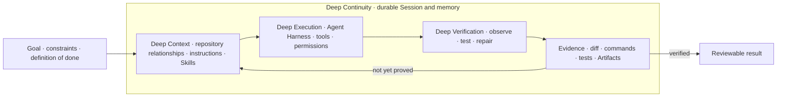
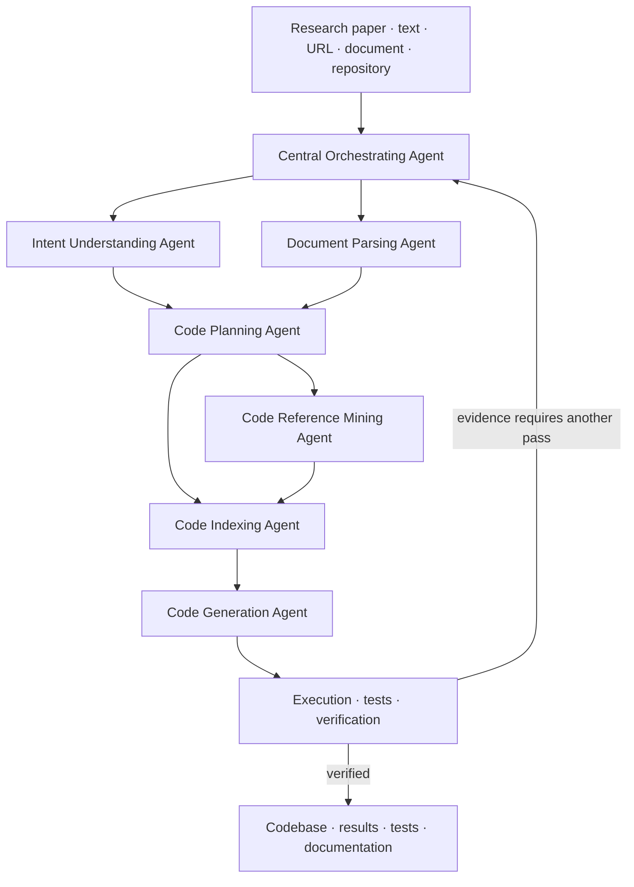

<div align="center">

<table style="border: none; margin: 0 auto; padding: 0; border-collapse: collapse;">
<tr>
<td align="center" style="vertical-align: middle; padding: 10px; border: none; width: 250px;">
  
</td>
<td align="left" style="vertical-align: middle; padding: 10px 0 10px 30px; border: none;">
  <pre style="font-family: 'Courier New', monospace; font-size: 16px; color: #0EA5E9; margin: 0; padding: 0; text-shadow: 0 0 10px #0EA5E9, 0 0 20px rgba(14,165,233,0.5); line-height: 1.2; transform: skew(-1deg, 0deg); display: block;">    ██████╗ ███████╗███████╗██████╗  ██████╗ ██████╗ ██████╗ ███████╗
    ██╔══██╗██╔════╝██╔════╝██╔══██╗██╔════╝██╔═══██╗██╔══██╗██╔════╝
    ██║  ██║█████╗  █████╗  ██████╔╝██║     ██║   ██║██║  ██║█████╗
    ██║  ██║██╔══╝  ██╔══╝  ██╔═══╝ ██║     ██║   ██║██║  ██║██╔══╝
    ██████╔╝███████╗███████╗██║     ╚██████╗╚██████╔╝██████╔╝███████╗
    ╚═════╝ ╚══════╝╚══════╝╚═╝      ╚═════╝ ╚═════╝ ╚═════╝ ╚══════╝</pre>
</td>
</tr>
</table>

<div align="center">
<a href="https://trendshift.io/repositories/14665" target="_blank"></a>
</div>

<!--  -->

#  DeepCode: Open Agentic Coding

### *Advancing Code Generation with Multi-Agent Systems*

<!-- <p align="center">
  

  
  
  
</p> -->
<p>
  <a href="https://github.com/HKUDS/DeepCode/stargazers"></a>
  <a href='https://arxiv.org/abs/2512.07921'></a>
  
  <!-- <a href="https://pypi.org/project/deepcode-hku/"></a> -->
</p>
<p>
  <a href="https://github.com/HKUDS/.github/blob/main/profile/README.md"></a>
  <a href="https://github.com/HKUDS/.github/blob/main/profile/README.md"></a>
</p>
<div align="center">
  <div style="width: 100%; height: 2px; margin: 20px 0; background: linear-gradient(90deg, transparent, #00d9ff, transparent);"></div>
</div>

<div align="center">
  <a href="#quick-start" style="text-decoration: none;">
    
  </a>
</div>

<div align="center" style="margin-top: 10px;">
  <a href="README.md">
    
  </a>
  <a href="README_ZH.md">
    
  </a>
</div>

### 🖥️ **Interface Showcase**

#### 🖥️ **CLI Interface**

**Terminal-Based Development**

<div align="center">

  

  <div style="background: linear-gradient(135deg, #2D3748 0%, #4A5568 100%); border-radius: 12px; padding: 15px; margin: 15px 0; color: white;">
    <strong>🚀 Advanced Terminal Experience</strong><br/>
    <small>⚡ Fast command-line workflow<br/>🔧 Developer-friendly interface<br/>📊 Real-time progress tracking</small>
  </div>

*Professional terminal interface for advanced users and CI/CD integration*
</div>

The legacy browser UI has been removed. The Tauri 2 workbench can be run from
source today; packaged Desktop releases are still under active development.
See the
[`P1 architecture`](docs/P1_APP_SERVER_ARCHITECTURE.md) and
[`desktop rebuild plan`](docs/TAURI_DESKTOP_REBUILD_PLAN.md).

---

<div align="center">

### 🎬 **Introduction Video**

<div style="margin: 20px 0;">
  <a href="https://youtu.be/PRgmP8pOI08" target="_blank">
    
  </a>
</div>

*🎯 **Watch our complete introduction** - See how DeepCode transforms research papers and natural language into production-ready code*

<p>
  <a href="https://youtu.be/PRgmP8pOI08" target="_blank">
    
  </a>
</p>

</div>

---

> *"Where AI Agents Transform Ideas into Production-Ready Code"*

</div>

---

## Table of contents

- [News](#news)
- [What Deep means in DeepCode](#what-deep-means-in-deepcode)
- [Core capabilities](#core-capabilities)
  - [Agent Harness](#agent-harness)
  - [Loop Engineering](#loop-engineering)
  - [Context Engineering](#context-engineering)
  - [Evidence-driven completion](#evidence-driven-completion)
  - [Durable local work](#durable-local-work)
  - [Models and Skills under your control](#models-and-skills-under-your-control)
  - [Parallel and repeatable work](#parallel-and-repeatable-work)
- [Quick start](#quick-start)
- [Using DeepCode](#using-deepcode)
- [Paper2Code](#paper2code)
  - [The original architecture](#the-original-architecture)
  - [Research results](#research-results)
- [Development](#development)
- [Community and research](#community-and-research)
- [License](#license)

<p align="center">
  
</p>

## News

**2026-07-21 · Durable Goals and safe Session lifecycle**

- Run long tasks as resumable, evidence-driven Goals shared by CLI and Desktop.
- Archive history for later or permanently delete it through one guarded
  Session lifecycle, without touching repository files.
- Interrupted deletions recover from a durable tombstone instead of reviving
  stale Session records.

**2026-07-20 · Session-level model control and shared Skills**

- Configure named LLM connections once and use them throughout DeepCode.
- Switch the connection or model for future Turns without losing the
  conversation that came before it.
- Discover, import, enable, and select the same project or user Skills
  regardless of how the task was started.

**2026-07-17 · Durable Session navigation and replay**

- Projects organize their own collapsible Session history while older Sessions
  remain discoverable across directories.
- Long conversations replay incrementally instead of being rejected as one
  oversized message.
- Approvals, change review, tests, and Artifacts remain attached to the task
  that produced them.

**2026-07-10 · Loop Engineering and parallel agents**

- Give DeepCode a goal and a verification command; it can inspect, implement,
  test, and repair through bounded rounds.
- Delegate focused work to agents in isolated worktrees, then surface conflicts
  explicitly before integration.

<details>
<summary><strong>Earlier milestones</strong></summary>

- **2026-07-08 · Durable Sessions and memory.** Session history survives
  restarts, project instructions can live in `AGENTS.md` or `DEEPCODE.md`, and
  persistent notes remain with the workspace.
- **2026-07-08 · General coding agent.** The free-form TUI, native file and shell
  tools, headless execution, context compaction, and cross-directory resume
  established the current product foundation.
- **2026-07-04 · Agent Harness foundation.** A shared execution contract,
  three-valued permissions, sensitive-path protection, platform sandboxing, and
  normalized events made supervised local execution possible.
- The complete pre-restructure history is preserved in the
  [legacy README](docs/archive/README_LEGACY_2026-07-20.md).

</details>

## What Deep means in DeepCode

The name is a product promise, not complexity for its own sake. DeepCode goes
beyond a plausible answer or an isolated patch. It follows the task through
repository relationships, real execution, verification failures, and the
context required to continue the work later.

| Depth                 | What it means                                                                                                   |
| --------------------- | --------------------------------------------------------------------------------------------------------------- |
| **Deep Context**      | Understand files together with their relationships, project instructions, selected Skills, history, and memory. |
| **Deep Execution**    | Work on real files and commands through an Agent Harness with permissions, approvals, and workspace boundaries. |
| **Deep Verification** | Feed tests, diagnostics, and failures back into the task instead of stopping at a convincing-looking response.  |
| **Deep Continuity**   | Preserve the Session, decisions, evidence, and recovery state across time, directories, and model changes.      |

Paper2Code established this pattern by following a research paper from
document understanding through reference mining, implementation, and
verification. The current general coding Agent applies the same depth to
everyday repository work.


```mermaid
flowchart LR
    INTENT["Goal · constraints · definition of done"]

    subgraph CONTINUITY["Deep Continuity · durable Session and memory"]
        CONTEXT["Deep Context · repository relationships · instructions · Skills"]
        EXECUTION["Deep Execution · Agent Harness · tools · permissions"]
        VERIFY["Deep Verification · observe · test · repair"]
        EVIDENCE["Evidence · diff · commands · tests · Artifacts"]

        CONTEXT --> EXECUTION
        EXECUTION --> VERIFY
        VERIFY --> EVIDENCE
        EVIDENCE -->|not yet proved| CONTEXT
    end

    INTENT --> CONTEXT
    EVIDENCE -->|verified| RESULT["Reviewable result"]
```

This is the product's operating model. The interface only determines how the
user enters and observes it.

## Core capabilities

The four kinds of depth become concrete through the following product
capabilities.

<p align="center">
  
</p>

### Agent Harness

The Harness is the part of DeepCode that turns a model response into work you
can supervise. It gives the Agent native read, search, edit, patch, shell, test,
and delegation capabilities while keeping every action inside one execution
contract.

- tool activity is streamed as progress rather than hidden behind a spinner;
- permission decisions are explicit: `allow`, `ask`, or `deny`;
- sensitive credential paths remain denied even in permissive modes;
- shell work is fenced to the workspace through the available macOS or Linux
  sandbox;
- interrupted or crashed work is settled without silently replaying side
  effects.

### Loop Engineering

One good response is not the same as a finished change. Loop Engineering lets
DeepCode work against an observable definition of done: a test command, build,
lint check, or another verification you choose.

Each round inspects the latest state, acts, runs the check, and uses the result
to decide what comes next. Maximum rounds and scheduled-run limits keep the
loop bounded, while Session history and project memory keep the reasoning
continuous.

### Context Engineering

DeepCode builds context from the repository rather than relying on a single
large prompt. It combines files and search results with project instructions,
selected Skills, Session history, and persistent workspace notes. Long
histories are compacted against the active model's context window so current
evidence remains useful without discarding the task's continuity.

Context is refreshed as the repository changes and as commands produce new
evidence. This keeps planning, implementation, and verification tied to the
latest observable state.

### Evidence-driven completion

DeepCode does not treat a fluent answer as proof that the task is finished.
Completion should be supported by the artifacts the task can actually
produce:

- a reviewable diff or generated file;
- command output, diagnostics, or test results;
- a recorded Artifact when the output is too large for the conversation;
- a concise explanation connecting the requested outcome to the evidence.

If verification fails, the failure becomes input to the next round. If a
boundary prevents completion, the boundary remains visible instead of being
reported as success.

### Durable local work

Start DeepCode from any repository. Sessions are stored under
`~/.deepcode/sessions/`, indexed by their original workspace, and remain
discoverable across directories. Resume after a restart or explicitly continue
the task in another working directory without rewriting its recorded origin.

A Session is the complete conversation. A Turn is one accepted unit of work.
Changing models affects future Turns only, so earlier work remains readable and
retries remain attributable to the configuration that produced them.

### Models and Skills under your control

DeepCode is not tied to one hosted model. Named connections can target
OpenRouter, OpenAI, Anthropic, supported providers, OpenAI-compatible gateways,
or local endpoints. Credentials stay in the user store; projects may select a
connection without taking ownership of its secret.

Skills are reusable workflow instructions. Keep them with a project or in your
user library, import them from a local directory, and select only the Skills a
Turn needs. Every execution path resolves the same catalog, and a Skill can
never raise its own permissions.

### Parallel and repeatable work

DeepCode can delegate bounded tasks to agents in isolated Git worktrees. Their
changes are integrated with conflict detection instead of sharing one mutable
checkout. Automations can submit recurring work through the same Session,
model, permission, and recovery rules as a manual Turn.

## Quick start

### 1. Install and initialize

```bash
pip install deepcode-hku
deepcode init
```

`deepcode init` creates the user-level configuration under `~/.deepcode/`.
After that, `deepcode` can be launched from any project directory.

### 2. Connect a model provider

```bash
deepcode provider set personal-openrouter \
  --template openrouter \
  --label "OpenRouter · Personal" \
  --api-key

deepcode provider test personal-openrouter
deepcode provider models personal-openrouter --refresh
```

`--api-key` uses a non-echoing prompt. Saved keys live in
`~/.deepcode/credentials.json` with user-only permissions; they are never
exposed to a client or written into Session history.

### 3. Start coding

```bash
deepcode -c personal-openrouter -m moonshotai/kimi-k3 --effort low
```

Or run one headless task:

```bash
deepcode exec "Fix the failing tests and explain the root cause" \
  --connection personal-openrouter \
  --model moonshotai/kimi-k3 \
  --effort low \
  --json
```

Choose whichever interface fits your workflow. `deepcode` opens the interactive
CLI; the same Sessions can also be opened in Desktop. To run Desktop from
source, install Node.js 22+, Rust stable, and the platform dependencies required
by Tauri, then run:

```bash
cd desktop
npm ci
npm run tauri -- dev
```

Open **Settings → Connections** to configure a provider, then select a
connection and model from the Session composer.

> The interface changes how the work is presented, not the Agent, policy,
> configuration, or Session history behind it. Packaged Desktop releases are
> still in development.

## Using DeepCode

### Sessions

```text
/new [title]             start a new Session
/resume                  list Sessions from the current directory
/resume all              list Sessions from every recorded directory
/resume <id>             restore one Session
/model [connection] [id] show or change the model for future Turns
/effort [auto|off|level] show or change Thinking for future Turns
/clear                   clear the current in-memory context
@src/main.py             attach a file to the next prompt
```

Start or resume directly:

```bash
deepcode -w ./my-project
deepcode --resume <session-id>
```

Session files remain under `~/.deepcode/sessions/` no matter which client opens
them. An explicit cross-directory resume changes the current execution context
without rewriting the Session's recorded origin.

Archive keeps canonical history and only removes a Session from the normal
Desktop list. Permanent deletion removes that history and its derived runtime
records while leaving repository files untouched. Desktop exposes both actions
in the Session menu; scripts can use the same application service through:

```bash
deepcode session delete <session-id> --yes
```

DeepCode refuses permanent deletion while the Session is open in another CLI,
has active work, owns a managed worktree, or belongs to an Automation. Resolve
the reported blocker first; deletion never force-kills work or silently removes
workspace state.

### Connections and models

Common commands:

```bash
deepcode provider list
deepcode provider test <connection-id>
deepcode provider models <connection-id> --refresh
deepcode provider remove <connection-id>
```

Use an environment variable instead of the credential store:

```bash
deepcode provider set work-openrouter \
  --template openrouter \
  --api-key-env OPENROUTER_API_KEY
```

Connect an arbitrary OpenAI-compatible endpoint:

```bash
deepcode provider set company-proxy \
  --template custom \
  --adapter openai_compat \
  --api-base https://llm.example.com/v1 \
  --catalog openai \
  --api-key
```

Built-in templates include `openrouter`, `openai`, `anthropic`, `deepseek`,
`gemini`, `zhipu`, `dashscope`, `ollama`, `vllm`, and `custom`.

To make one connection/model the shared default, edit the user-level
`~/.deepcode/deepcode_config.json`:

```json
{
  "agents": {
    "defaults": {
      "connection": "personal-openrouter",
      "model": "moonshotai/kimi-k3",
      "reasoningEffort": "low"
    }
  }
}
```

Project configuration may select a user-owned connection, but cannot replace
its endpoint, adapter, headers, or credential.

Thinking levels come from the selected model's catalog rather than a global
hard-coded list. `auto` follows the provider/model default; `off` is offered
only when the model permits it. A Session switch affects future Turns without
rewriting earlier history. DeepCode never renders raw chain-of-thought as
assistant text; only a provider-designated summary may appear, while signed or
encrypted continuation state remains private in the canonical Session.

### Skills

DeepCode discovers Skills from both DeepCode and Claude-compatible locations:

```text
.deepcode/skills/        project DeepCode Skills
.claude/skills/          project Claude-compatible Skills
~/.deepcode/skills/      user DeepCode Skills
~/.claude/skills/        user Claude-compatible Skills
```

Manage them from the CLI:

```bash
deepcode skill list
deepcode skill show <id-or-name>
deepcode skill import ./my-skill --scope project
deepcode skill disable <skill-id> --scope project
```

Select Skills for the next interactive Turn:

```text
/skills
/skill <id-or-name>
/skill remove <id-or-name>
/skill clear
```

Headless tasks accept repeatable `--skill` flags:

```bash
deepcode exec "Review this change for security regressions" \
  --skill security-review \
  --skill test-strategy
```

A Skill supplies workflow instructions. It cannot grant permissions or bypass
project trust, sandbox, approval, or tool policy.

### Safety and execution

DeepCode treats execution as a product boundary rather than a client-side
confirmation:

- Projects require explicit trust before interactive Agent execution.
- Permission decisions are `allow`, `ask`, or `deny`.
- An approval resumes the exact suspended tool call.
- Sensitive credential paths remain denied in every permission mode.
- Shell and code processes are terminated as owned process trees on timeout,
  interruption, or shutdown.
- Crash recovery settles incomplete Turns without automatically replaying side
  effects.

### Long-running work

In the interactive CLI, attach a durable Goal to the current Session:

```text
/goal Implement and verify the requested feature
/goal status
/goal pause
/goal resume
/goal clear
```

The Goal is stored beside the canonical Session transcript and appears in
Desktop. Every attempt is an ordinary Turn, so model selection, Skills,
permissions, approvals, recovery, and history stay aligned across clients.
Safety limits and the optional evaluator connection/model are user-configurable
through the `goal` block shown in `deepcode_config.json.example`; no provider
or model is fixed by the Goal engine.

For scripts and CI, the compatibility command uses the same Goal engine and
stops when its discovered, allowlisted verification command passes:

```bash
deepcode loop "Implement the requested feature" \
  --test-cmd pytest \
  --max-rounds 6
```

Run a bounded scheduled job:

```bash
deepcode schedule loop "Repair the failing test suite" \
  --test-cmd "python -m pytest -q" \
  --every 3600 \
  --max-runs 5
```

Automations submit work through the normal Turn path, so scheduled and manual
runs retain the same Session, permission, model, and recovery rules.

## Paper2Code

Paper2Code is the research origin of DeepCode and remains its specialized
workflow for scientific code reproduction. The general coding Agent extends
the product; it does not replace or flatten the original Paper2Code design.

Its central idea is unchanged: reproducing a paper is not a one-shot generation
task. A central orchestrator coordinates distinct responsibilities for
understanding the source, planning the reproduction, finding and indexing
useful references, implementing the system, and verifying the result.

### The original architecture


```mermaid
flowchart TB
    INPUT["Research paper · text · URL · document · repository"] --> ORCH["Central Orchestrating Agent"]

    ORCH --> INTENT["Intent Understanding Agent"]
    ORCH --> DOC["Document Parsing Agent"]
    INTENT --> PLAN["Code Planning Agent"]
    DOC --> PLAN

    PLAN --> MINE["Code Reference Mining Agent"]
    PLAN --> INDEX["Code Indexing Agent"]
    MINE --> INDEX
    INDEX --> BUILD["Code Generation Agent"]

    BUILD --> VERIFY["Execution · tests · verification"]
    VERIFY -->|evidence requires another pass| ORCH
    VERIFY -->|verified| OUTPUT["Codebase · results · tests · documentation"]
```

The specialist roles preserve the separation of concerns that made the
original system effective:

| Role                            | Responsibility                                                                                                                      |
| ------------------------------- | ----------------------------------------------------------------------------------------------------------------------------------- |
| **Central Orchestrating Agent** | Interprets progress, selects the next phase, coordinates specialists, and adapts the plan when evidence changes.                    |
| **Intent Understanding Agent**  | Turns the user's objective into explicit functional requirements, technical constraints, and an actionable task decomposition.      |
| **Document Parsing Agent**      | Processes papers and technical documents, extracting algorithms, equations, methods, assumptions, and implementation requirements.  |
| **Code Planning Agent**         | Converts the understood method into an implementation roadmap, module boundaries, dependencies, interfaces, and verification goals. |
| **Code Reference Mining Agent** | Discovers relevant repositories, libraries, and implementation patterns, then evaluates their relevance and integration potential.  |
| **Code Indexing Agent**         | Builds a searchable semantic index and knowledge graph so useful components and relationships can be recovered during generation.   |
| **Code Generation Agent**       | Synthesizes the plan and evidence into executable code, tests, documentation, and the interfaces needed for a reproducible result.  |

Four ideas connect those roles into one system:

- **Intelligent orchestration.** The central Agent chooses and revisits phases
  according to task state instead of treating reproduction as a fixed prompt
  chain.
- **Document and intent grounding.** Papers, specifications, URLs, and attached
  files are converted into explicit implementation requirements before code is
  written.
- **Memory and CodeRAG.** Large documents and reference repositories are
  segmented, indexed, and retrieved as bounded context rather than repeatedly
  placed into the model window.
- **Iterative verification.** Execution, tests, and observed failures feed back
  into planning and implementation until the deliverable has supporting
  evidence.

The supporting tool layer follows the same division:

| Layer                     | Purpose                                                                                           |
| ------------------------- | ------------------------------------------------------------------------------------------------- |
| Document ingestion        | Fetch and normalize papers, URLs, PDFs, DOCX, presentations, text, and HTML.                      |
| Document segmentation     | Divide long technical material into coherent, recoverable sections for analysis.                  |
| Reference discovery       | Find candidate repositories and supporting implementations.                                       |
| Code reference indexing   | Build searchable context over external and local code, including cross-file relationships.        |
| Implementation execution  | Read and write files, run shell or Python commands, inspect the project structure, and keep logs. |
| Verification and delivery | Run tests, record results, and deliver the codebase together with documentation and Artifacts.    |

The modern product adds durable plans, explicit plan review, checkpoints,
bounded retries, and interactive inspection around this workflow. Those
additions make recovery and supervision stronger while preserving the
Paper2Code architecture and its order of reasoning.

<!--
README VISUAL SLOT — PAPER2CODE WORKFLOW

Add a current Paper2Code workflow capture at:
  assets/readme/paper2code-workflow.png

Capture:
- the workflow plan or checkpoint state;
- one verification result;
- the Artifact/Inspector surface.

Do not reuse the legacy browser UI screenshot.
-->

### Research results

The original DeepCode study evaluates scientific code reproduction on
[PaperBench](https://openai.com/index/paperbench/), which asks agents to
reproduce 20 ICML 2024 papers across 8,316 gradable components.

<p align="center">
  
</p>

| Evaluation subset       | DeepCode | Reported comparison                   | Difference   |
| ----------------------- | -------- | ------------------------------------- | ------------ |
| Human expert subset     | 75.9%    | Best reported human baseline: 72.4%   | +3.5 points  |
| Commercial-agent subset | 84.8%    | Best reported commercial agent: 58.7% | +26.1 points |
| Scientific coding       | 73.5%    | PaperCoder: 51.1%                     | +22.4 points |
| LLM-agent baseline      | 73.5%    | Best reported LLM agent: 43.3%        | +30.2 points |

These are PaperBench-specific results reported by the original study. They are
not a general-purpose coding benchmark or a comparison against continuously
updated products.

Read the [paper](https://arxiv.org/abs/2512.07921) for methodology, evaluation
scope, models, and baseline details.

Legacy demonstrations remain available as historical examples:

- [Paper2Code demonstration](https://www.youtube.com/watch?v=MQZYpLkzsbw)
- [Frontend implementation demonstration](https://www.youtube.com/watch?v=78wx3dkTaAU)
- [Project introduction](https://youtu.be/PRgmP8pOI08)

## Development

### Source installation

```bash
git clone https://github.com/HKUDS/DeepCode.git
cd DeepCode

curl -LsSf https://astral.sh/uv/install.sh | sh
uv venv --python=3.13
source .venv/bin/activate
uv pip install -r requirements.txt
pip install -e .
```

On Windows, activate with `.venv\Scripts\activate`.

### Verification

```bash
uvx pre-commit run --all-files
PYTHONPATH=. pytest -q

cd desktop
npm run lint
npm test -- --run
npm run build
```

Desktop packaging, Rust checks, signing, and release procedures are documented
in [`desktop/README.md`](desktop/README.md) and the
[Desktop release runbook](docs/DESKTOP_RELEASE_RUNBOOK.md).

<details>
<summary><strong>Contributor architecture notes</strong></summary>

| Topic                                         | Document                                                      |
| --------------------------------------------- | ------------------------------------------------------------- |
| Agent execution and approvals                 | [P2 Agent execution](docs/P2_AGENT_EXECUTION_ARCHITECTURE.md) |
| Desktop sidecar and lifecycle                 | [P3 Desktop runtime](docs/P3_DESKTOP_RUNTIME_ARCHITECTURE.md) |
| Git review, files, terminal, and tests        | [P4 Code workbench](docs/P4_CODE_WORKBENCH_ARCHITECTURE.md)   |
| Durable Paper2Code workflow                   | [P5 Paper2Code](docs/P5_PAPER2CODE_ARCHITECTURE.md)           |
| Canonical Sessions and cross-directory resume | [P6 Session alignment](docs/P6_SESSION_ALIGNMENT_REVIEW.md)   |
| Skills identity, security, and persistence    | [Skills architecture](docs/SKILLS_PRODUCT_ARCHITECTURE.md)    |
| Desktop product and interaction model         | [Desktop UI specification](docs/DESKTOP_PRODUCT_UI_SPEC.md)   |
| Privacy and diagnostics                       | [Privacy contract](docs/PRIVACY_AND_DIAGNOSTICS.md)           |

</details>

The pre-restructure README is preserved in
[`docs/archive/README_LEGACY_2026-07-20.md`](docs/archive/README_LEGACY_2026-07-20.md).
The empty product-image slots have a shared
[capture brief](assets/readme/README.md).

## Community and research

<p align="center">
  <a href="https://star-history.com/#HKUDS/DeepCode&Date">
    <picture>
      <source media="(prefers-color-scheme: dark)" srcset="https://api.star-history.com/svg?repos=HKUDS/DeepCode&type=Date&theme=dark" />
      <source media="(prefers-color-scheme: light)" srcset="https://api.star-history.com/svg?repos=HKUDS/DeepCode&type=Date" />
      
    </picture>
  </a>
</p>

If DeepCode contributes to your research, cite:

```bibtex
@misc{li2025deepcodeopenagenticcoding,
  title         = {DeepCode: Open Agentic Coding},
  author        = {Zongwei Li and Zhonghang Li and Zirui Guo and Xubin Ren and Chao Huang},
  year          = {2025},
  eprint        = {2512.07921},
  archivePrefix = {arXiv},
  primaryClass  = {cs.SE},
  url           = {https://arxiv.org/abs/2512.07921}
}
```

## License

DeepCode is available under the [MIT License](LICENSE).
