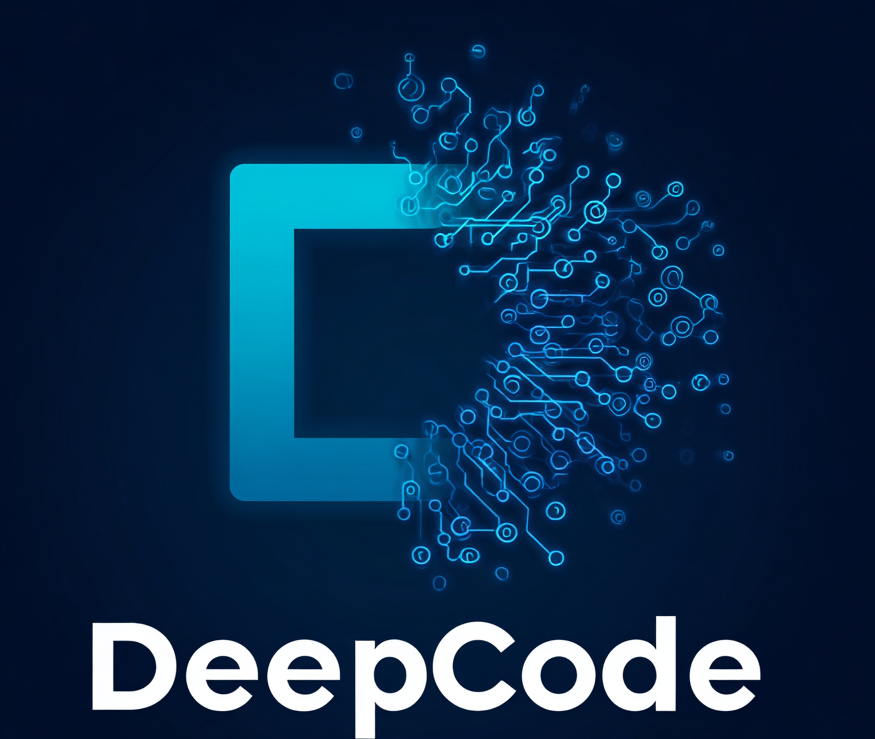
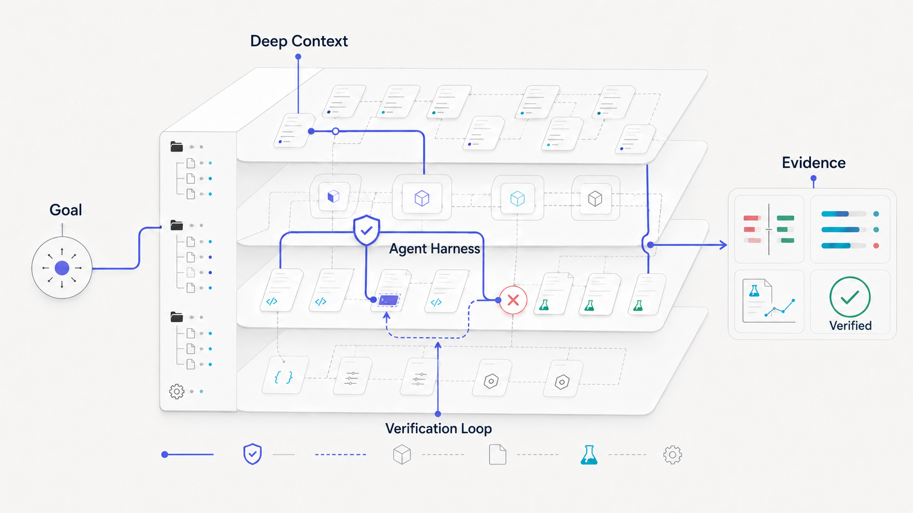
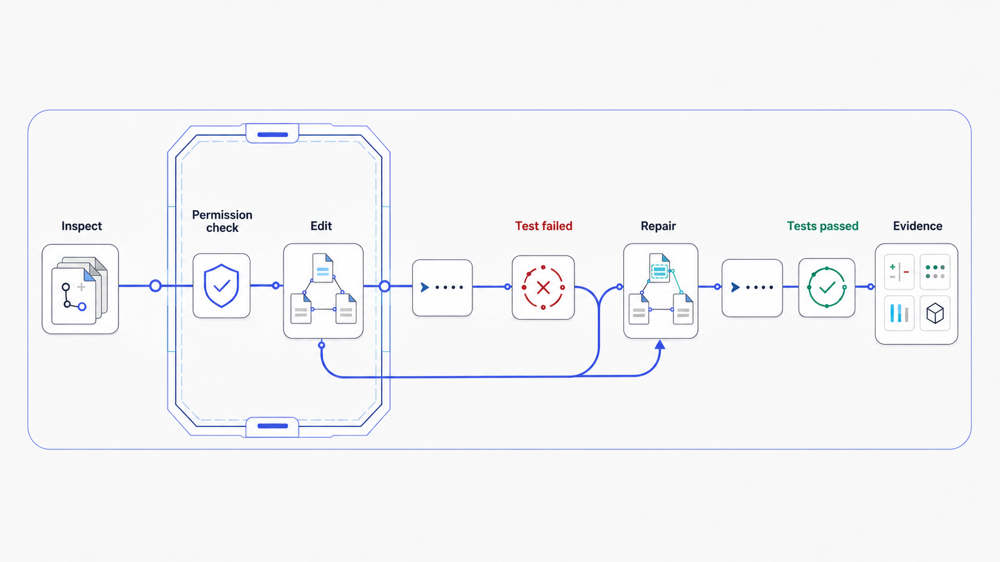
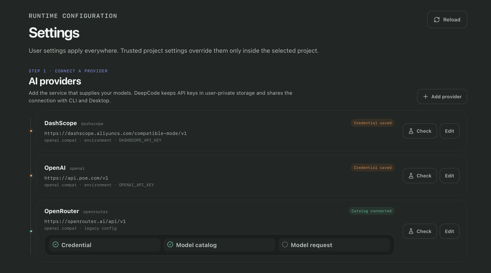
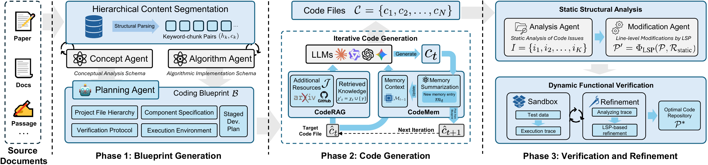
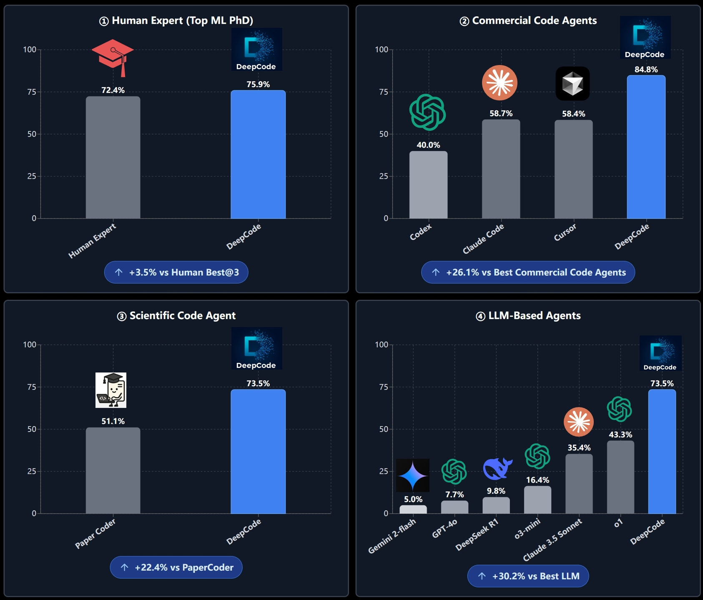

<div align="center">

<table style="border: none; margin: 0 auto; padding: 0; border-collapse: collapse;">
<tr>
<td align="center" style="vertical-align: middle; padding: 10px; border: none; width: 250px;">
  
</td>
<td align="left" style="vertical-align: middle; padding: 10px 0 10px 30px; border: none;">
  <pre style="font-family: 'Courier New', monospace; font-size: 16px; color: #0EA5E9; margin: 0; padding: 0; text-shadow: 0 0 10px #0EA5E9, 0 0 20px rgba(14,165,233,0.5); line-height: 1.2; transform: skew(-1deg, 0deg); display: block;">    ██████╗ ███████╗███████╗██████╗  ██████╗ ██████╗ ██████╗ ███████╗
    ██╔══██╗██╔════╝██╔════╝██╔══██╗██╔════╝██╔═══██╗██╔══██╗██╔════╝
    ██║  ██║█████╗  █████╗  ██████╔╝██║     ██║   ██║██║  ██║█████╗
    ██║  ██║██╔══╝  ██╔══╝  ██╔═══╝ ██║     ██║   ██║██║  ██║██╔══╝
    ██████╔╝███████╗███████╗██║     ╚██████╗╚██████╔╝██████╔╝███████╗
    ╚═════╝ ╚══════╝╚══════╝╚═╝      ╚═════╝ ╚═════╝ ╚═════╝ ╚══════╝</pre>
</td>
</tr>
</table>

<div align="center">
<a href="https://trendshift.io/repositories/14665?utm_source=repository-badge&amp;utm_medium=badge&amp;utm_campaign=badge-repository-14665" target="_blank" rel="noopener noreferrer"></a>
<a href="https://trendshift.io/repositories/14665?utm_source=trendshift-badge&amp;utm_medium=badge&amp;utm_campaign=badge-trendshift-14665" target="_blank" rel="noopener noreferrer"></a>
</div>

<!--  -->

#  DeepCode: 开源智能体编程

### *基于多智能体系统推进代码生成技术*

<!-- <p align="center">
  

  
  
  
</p> -->
<p>
  <a href="https://github.com/HKUDS/DeepCode/stargazers"></a>
  
  <a href="https://pypi.org/project/deepcode-hku/"></a>
</p>
<p>
  <a href="https://discord.gg/yF2MmDJyGJ"></a>
  <a href="https://github.com/HKUDS/DeepCode/issues/11"></a>
</p>
<div align="center">
  <div style="width: 100%; height: 2px; margin: 20px 0; background: linear-gradient(90deg, transparent, #00d9ff, transparent);"></div>
</div>

<div align="center">
  <a href="#快速开始" style="text-decoration: none;">
    
  </a>
</div>

<div align="center" style="margin-top: 10px;">
  <a href="README.md">
    
  </a>
  <a href="README_ZH.md">
    
  </a>
</div>

### 🖥️ **界面展示**

#### 🖥️ **DeepCode Desktop**

<div align="center">

  

*在可视化工作台中使用 DeepCode，管理 Session 和目标，并查看工具活动、代码修改与验证过程。*
</div>

DeepCode 只有一套 Agent 运行时，同时提供两种使用界面：面向终端
工作流的交互式 CLI，以及用于 Session、审查和设置的 Tauri Desktop。
两端打开同一份本地 Project、Session 历史、模型、Skills、权限、Goals 与
Automations。从源码启动请参考
[`Desktop 运行指南`](desktop/README.md)。

---

<div align="center">

### 🎬 **介绍视频**

<div style="margin: 20px 0;">
  <a href="https://youtu.be/PRgmP8pOI08" target="_blank">
    
  </a>
</div>

*🎯 **观看我们的完整介绍** - 了解DeepCode如何将研究论文和自然语言转换为生产就绪的代码*

<p>
  <a href="https://youtu.be/PRgmP8pOI08" target="_blank">
    
  </a>
</p>

</div>

---

> *"AI智能体将创意转化为生产就绪代码的地方"*

</div>

---

## 📑 目录

- [📰 新闻](#新闻)
- [🧠 DeepCode 中的 Deep](#deepcode-中的-deep)
- [🚀 核心能力](#核心能力)
  - [Agent Harness](#agent-harness)
  - [Loop Engineering](#loop-engineering)
  - [Context Engineering](#context-engineering)
  - [以证据判断完成](#以证据判断完成)
  - [持久化本地工作](#持久化本地工作)
  - [由用户控制的模型与 Skills](#由用户控制的模型与-skills)
  - [实时 Web 调研](#live-web-research)
  - [并行且可重复的工作](#并行且可重复的工作)
- [⚡ 快速开始](#快速开始)
- [🧭 使用 DeepCode](#使用-deepcode)
- [⚙️ Headless 与 Automation](docs/HEADLESS_AND_AUTOMATION.md#中文)
- [🔬 Paper2Code](#paper2code)
  - [原始架构](#原始架构)
  - [研究结果](#研究结果)
- [🎬 实时演示](#live-demonstrations)
- [🛠️ 开发](#开发)
- [⭐ 星标历史](#star-history)
- [🙏 致谢](#contributors)
- [📖 引用](#citation)
- [📄 许可证](#license)

<p align="center">
  
</p>

## 新闻

**2026-08-07 · 思考强度控制、更多模型服务商、可调的 Desktop**

- **思考强度控制全面恢复。** 思考档位改为从模型目录解析，Claude、GPT-5、
  Kimi、Qwen、Grok 都能选到各自真实的档位，DeepSeek、GLM、MiniMax 也拿到了
  可用的思考开关。新发布的模型会继承同族的能力，而不会悄悄失去控制项。
- **新增三家模型服务商。** Requesty 与 Forge 作为网关加入，MiniMax 拥有独立的
  目录条目——包含 100 万上下文的 M3 层级。
- **把 Desktop 调成你习惯的样子。** 设置 → 外观新增会话区宽度、不再盲从系统的
  浅色/深色手动切换、字号，以及只列出本机实际已安装字体的字体选择。
- **Windows 上的命令执行更安全。** 新的 Job Object 后端为沙箱带来了真正的
  进程树隔离——此前这里是空白。

**2026-08-04 · 让 Skills 在每一种工作方式中保持一致**

- **让可复用经验跟随项目。** DeepCode 既能发现当前项目中的 Skills，
  也能使用个人 Skill 集合，并继续兼容现有 DeepCode 与 Claude 风格目录。
- **在 CLI 与 Desktop 中使用同一个 Skill。** 为任务选择 Skill 后，
  DeepCode 会把它的身份和版本保留在 Turn 中，方便在 Session 中追溯
  哪些指导影响了结果。
- **不离开 DeepCode 也能创建 Skill。** 内置 Skill Creator 可在两端
  帮助创建和验证聚焦、可复用的工作流。
- **Skill 库增长后依然保持专注。** 上下文感知的发现机制会控制
  Agent 上下文中的信息量，同时保留完整的 Skill 浏览与管理能力。

**2026-08-03 · 🎉 DeepCode v2.0 正式发布**

DeepCode v2.0 带来一套全新的通用型 Coding Agent 框架，面向真实软件项目的
开发、修复、理解与持续改进。

- **直接完成真实仓库任务。** DeepCode 可以理解代码库、修改文件、运行命令
  与测试、检查变化，并把需求推进到真正可以工作的结果。
- **通过 Loop Engineering 持续完成复杂目标。** 给出一个 Goal，DeepCode
  可以持续理解、实现、验证和修复，而不是生成一段看似合理的回答就停止。
- **Agent 工作时，你始终掌握方向。** 随时补充要求、纠正方向、切换模型、
  停止、恢复或修改 Goal，不必丢掉已经完成的工作。
- **清楚看到交付了什么。** 规划、工具活动、代码变化、测试结果和验证证据
  都可以查看，让审查结果和放心合并变得更容易。
- **让 Automation 适应你的工作方式。** 用自然语言把任意要求变成某个项目
  专属的任务：既可随时手动运行，也可按固定间隔自动执行，还能修改、暂停、
  恢复并查看每次结果。无论是回归检查、测试修复、文档同步还是仓库维护，
  都可以交给 DeepCode 持续处理。
- **按照自己的方式工作。** 自由选择 Desktop 或 CLI，使用自己的模型与
  Skills，并委派聚焦任务，而不必改变底层 Agent 工作流。

DeepCode v2.0 希望让你少花时间逐步盯着 Agent，多花时间完成真正值得发布的
软件。期待看到你用它创造出的作品！🚀

**2026-07-31 · CLI 与 Desktop 共用统一执行模型**

- 交互式对话、无头任务、Goal、Automation 与 Desktop 全部进入同一套持久化
  Project、Session、Thread 和 Turn 生命周期。
- Workspace trust 与 Session 工具权限相互独立；权限可选 **Ask**、
  **Read only** 或 **Full access**。
- 模型 Thinking 强度与推理展示详细度分开控制，改变界面展示不会改变模型请求。

**2026-07-21 · 持久化 Goals 与安全的 Session 生命周期**

- 长任务可以作为 CLI 与 Desktop 共享的可恢复、证据驱动 Goal 运行。
- Archive 保留历史；永久删除通过统一的 Session 生命周期清理记录，
  不会删除仓库文件。
- 中断的删除会从持久化 tombstone 恢复，不会让旧 Session 记录重新出现。

**2026-07-20 · Session 级模型控制与共享 Skills**

- 命名 LLM 连接只需配置一次，即可在整个 DeepCode 中使用。
- 为后续 Turn 切换连接或模型时，不会丢失之前的完整对话。
- 无论任务从哪里启动，都能发现、导入、启用和选择同一套项目级或用户级 Skills。

**2026-07-17 · 持久化 Session 导航与回放**

- 每个 Project 管理自己的可折叠 Session 列表，同时仍可跨目录发现更早的记录。
- 长对话采用增量回放，不再因为把全部历史作为一条超大消息传输而失败。
- 批准、变更审查、测试与 Artifacts 始终保留在产生它们的任务中。

**2026-07-10 · Loop Engineering 与并行 Agent**

- 给出一个可修改的 Goal，DeepCode 可以在普通 Turn 之间持续理解、
  实现、按需验证与修复，并且始终可被纠正。
- 将聚焦任务委派给隔离 worktree 中的 Agent，并在集成前明确暴露冲突。

<details>
<summary><strong>更早的里程碑</strong></summary>

- **2026-07-08 · 持久化 Sessions 与记忆。** Session 历史可以跨重启恢复；
  项目长期指令可以写入 `AGENTS.md` 或 `DEEPCODE.md`，持久笔记跟随工作区保存。
- **2026-07-08 · 通用 Coding Agent。** 自由对话式 TUI、原生文件与 Shell 工具、
  无头执行、上下文压缩和跨目录恢复，建立了当前产品基础。
- **2026-07-04 · Agent Harness 基础。** 统一执行约束、三值权限、
  敏感路径保护、平台 Sandbox 与标准化事件，使本地执行真正可监督。
- 重构前的完整更新记录保存在
  [旧版中文 README](docs/archive/README_ZH_LEGACY_2026-07-20.md)。

</details>

## What Deep means in DeepCode

大多数 Coding Agent 都能生成代码。真正困难的是：理解一个真实项目、在正确的边界内完成修改、根据运行结果持续修正，并让用户清楚地知道结果为什么可信。

DeepCode 是一个面向真实软件工程的开源 Coding Agent。你可以把一个简单修改交给它，也可以给它一个需要持续数十个步骤的目标。它能够理解项目、操作代码、运行工具、验证结果，并在中断、重启或模型切换之后继续工作。

“Deep”代表四种贯穿任务始终的深度：

| 深度                  | 对用户意味着什么                                                                                         |
| --------------------- | -------------------------------------------------------------------------------------------------------- |
| **Deep Context**      | 不只读取当前文件，还结合项目结构、工程规则、Skills、Session 历史和长期记忆理解任务。                     |
| **Deep Execution**    | 不只提出建议，而是实际搜索、编辑、运行命令、执行测试，并展示正在发生的工作。                             |
| **Deep Verification** | 不把一段听起来合理的回答当作完成，而是使用测试、构建、诊断、Diff 和任务产物检查结果。                    |
| **Deep Continuity**   | 保存对话、决策、工具记录和验证证据，让任务可以跨时间、目录、客户端和模型继续。                           |

DeepCode 最特别的地方可以归纳为三点：

- **从复杂知识走向可运行系统。** DeepCode 不只处理 Issue 和代码片段。Paper2Code 可以从论文、文档、参考仓库和实验目标出发，完成理解、实现与验证。
- **让长任务持续运行，同时始终可控。** Goal 不是一次性的提示词。你可以在运行中补充要求、修订目标、暂停、停止或继续，而不必丢掉已经完成的工作。
- **从代码修改走到验证与审查。** DeepCode 不会停在生成 Patch。它会根据任务运行命令与测试、检查构建结果和文件变化，并把 Goal 的完成或受阻原因关联到相关执行记录，方便你审查最终修改。

DeepCode 的目标不是让 Agent 显得更忙，而是帮助你更可靠地完成真正的软件工程工作。

## Core capabilities

DeepCode 提供完整的本地 Coding Agent 工作流。CLI 和 Desktop 只是两种使用方式，它们共享同一套 Agent、Session、模型、Skills、权限和任务状态。

<p align="center">
  
</p>

### Work directly in your repository

DeepCode 可以读取和搜索代码、编辑文件、应用 Patch、运行命令与测试，并根据结果继续修改。工具调用、执行进度和文件变化会被持续展示，你可以随时查看 Agent 做了什么以及项目发生了哪些变化。

它既适合解释代码、修复 Bug 和补充测试，也能完成跨文件重构、功能开发和较长的仓库级任务。

当你提供一个公开的 HTTP 或 HTTPS URL 时，共享的 `web_fetch` 工具可以直接读取页面，不需要搜索服务或额外的 API Key。

### Goal-driven Loop Engineering

对于无法在一次回答中完成的任务，你可以直接给 DeepCode 一个自然语言 Goal。Agent 会围绕目标持续进行分析、实现、验证和修复，而不需要用户手动推动每一个步骤。

运行过程中，你仍然可以：

- 向当前任务补充新的信息；
- 修订 Goal 或验收要求；
- 排队下一条指令；
- 暂停、停止或继续任务；
- 在退出程序后恢复同一个 Goal。

任务不会因为进入自动执行就失去控制权。你始终可以改变接下来的方向。

### Evidence-driven completion

DeepCode 不使用一套硬编码规则判断所有 Coding 任务。它会根据任务本身选择合适的证据，例如测试结果、构建输出、静态检查、诊断信息、文件变化、Diff 或生成的 Artifacts。

验证失败不会被包装成成功，而会成为下一轮修复的输入。任务完成或真正受阻时，结果、原因以及相关证据会继续保留在 Session 中，方便你检查和复现。

### Durable Sessions and project context

每个 Session 都会保存在本地，并关联到它最初所属的项目。你可以从任意目录启动 DeepCode，找到之前的项目和 Session，在 CLI 或 Desktop 中继续同一段工作。

Session 不只保存聊天文本，还保存工具调用、权限决策、Goal、模型配置和验证记录。项目规则、持久记忆、Skills 与长对话压缩共同帮助 Agent 在复杂任务中保持上下文连续。

### Your models, your reasoning settings

DeepCode 不绑定单一模型厂商。你可以连接 OpenRouter、OpenAI、Anthropic、DeepSeek、Gemini、OpenAI-compatible Gateway、Ollama、vLLM 或其他兼容端点，并使用自己的 API Key。

连接可以在使用前检查凭据、模型列表和真实推理请求。每个 Session 都可以选择模型与 Thinking Level；中途切换模型只影响后续 Turn，不会删除已有对话或混淆之前的工作来源。模型支持时，DeepCode 也会展示 Provider 返回的推理摘要。

### Reusable Skills

Skills 可以把团队规范、领域知识、评审方法或重复工作流变成 Agent 可复用的能力。项目 Skill 放在 `.agents/skills`，个人 Skill 放在 `~/.agents/skills`，也可以通过内置 Skill Creator 以对话方式创建。

DeepCode 继续读取已有的 `.deepcode/skills` 和 Claude 风格目录，不会自动迁移。Skill 可以指导 Agent 如何工作，但不能绕过项目信任、工具权限或安全边界。

### Permissions you can understand

每个项目在执行前都需要明确信任。每个 Session 可以选择：

- **Ask**：敏感操作执行前询问；
- **Read only**：只允许分析和读取；
- **Full access**：对可信项目执行完整工作。

工具级别还支持 `allow`、`ask` 和 `deny`。CLI 与 Desktop 使用相同的权限状态，任务被停止或异常中断时，DeepCode 不会静默重放可能产生副作用的操作。

### Parallel agents without file collisions

复杂任务可以被拆分给多个专门的 Agent，例如让不同 Agent 分别负责代码调查、测试分析和实现审查。

并行修改可以运行在隔离的 Git Worktree 中，避免多个 Agent 同时修改同一个工作目录。结果返回主任务后再进行检查和整合，冲突会被明确展示，而不是被静默覆盖。主 Agent 始终负责最终 Goal，不会因为委派任务而失去方向。

### Automate repeatable engineering work

当一项工作已经足够稳定，可以把它保存为 Automation，手动运行或按时间间隔重复执行。例如：

- 定期检查测试和构建状态；
- 扫描回归问题；
- 整理待处理任务；
- 执行仓库维护或周期性审查。

Automation 不会启动另一套简化版 Agent。它仍然使用正常的 Session、模型、Skills、权限、审批和恢复机制，并保留每一次运行的历史。

### Paper2Code

Paper2Code 是 DeepCode 最初的研究方向，也是当前产品中专门面向科研复现的工作流。

它可以从论文、技术文档、URL 或参考仓库开始，理解研究目标，寻找相关实现，组织开发计划，生成代码，并通过实验与产物验证结果。它体现了 DeepCode 的核心理念：重要的不是生成一段看起来正确的代码，而是把复杂知识转化为可以运行、检查和继续改进的系统。

## 快速开始

DeepCode 提供两种界面，并且对应两条独立安装路径。任选一种即可开始；两端
使用相同的 Agent 运行时和规范 Session 历史。

> `uv tool install --python 3.12 deepcode-hku` 安装的是 CLI 和共享 Python
> 运行时，**不会**安装 Tauri Desktop 应用。

### 方案 A：安装 CLI

如果尚未安装 `uv`，请先安装。Windows PowerShell 使用：

```powershell
winget install --id astral-sh.uv --exact
```

首次安装 `uv` 后重新打开终端，再执行：

```console
uv tool install --python 3.12 deepcode-hku
deepcode init
```

这里显式选择 Python 是有意的：DeepCode 要求 Python 3.12+，不能在旧解释器上
回退安装已经不受支持的历史版本。
如果现有 uv tool 环境仍安装着 DeepCode 1.x，可执行
`uv tool upgrade --python 3.12 deepcode-hku` 完成迁移。

首次创建模型连接。`--api-key` 会打开不回显的安全输入：

```console
deepcode provider set personal-openrouter --template openrouter --label "OpenRouter · Personal" --api-key
deepcode provider models personal-openrouter --refresh
deepcode provider test personal-openrouter --model <model-id>
```

进入希望 DeepCode 操作的仓库，然后启动交互式 Agent：

```console
cd <你的项目>
deepcode
```

`deepcode init` 会在 `~/.deepcode/` 下创建最小用户配置。凭证单独保存在
用户私有存储中，不会进入 Session 历史。也可以在合适的 Python 3.12+
环境中使用 `pipx install deepcode-hku` 或 `pip install deepcode-hku`。

### 方案 B：安装 Desktop

Desktop 安装包与 Python 包分开发布。先检查
[GitHub Releases](https://github.com/HKUDS/DeepCode/releases) 是否提供当前
平台的签名安装包；如果没有，请使用下面的源码安装流程。

#### macOS 与 Linux 源码安装

请先根据 [Tauri 2 前置依赖指南](https://v2.tauri.app/start/prerequisites/)
安装平台依赖，并准备 Git、Python 3.12+、`uv`、Node.js 22+ 和稳定版 Rust。
然后执行：

```bash
git clone https://github.com/HKUDS/DeepCode.git
cd DeepCode
uv venv --python 3.12
uv pip install --python .venv/bin/python -e .
.venv/bin/deepcode init
cd desktop
npm ci
npm run setup:sidecar
npm run build:sidecar
cd ..
mkdir -p ~/.local/bin
ln -sf "$(pwd)/scripts/deepcode-desktop" ~/.local/bin/deepcode-desktop
export PATH="$HOME/.local/bin:$PATH"
deepcode-desktop
```

以上步骤会完成一次性的源码启动器安装。以后只要 `~/.local/bin` 已加入
`PATH`，就可以从任意目录运行 `deepcode-desktop` 启动这个源码版本。如果
Shell 尚未配置该路径，请把上述 export 写入 Shell profile。命令只负责启动
Desktop；需要操作的仓库仍应在 Project 侧边栏中添加或选择。

#### Windows 源码安装

Windows 必须安装 Microsoft Edge WebView2，以及 Visual Studio 2022 Build
Tools 的 **Desktop development with C++** 工作负载。Build Tools 弹出 UAC
提示时请选择“是”：

```powershell
winget install --id Git.Git --exact
winget install --id astral-sh.uv --exact
winget install --id OpenJS.NodeJS.LTS --exact
winget install --id Rustlang.Rustup --exact
winget install --id Microsoft.VisualStudio.2022.BuildTools --exact `
  --override "--wait --passive --norestart --add Microsoft.VisualStudio.Workload.VCTools --includeRecommended"
```

关闭 PowerShell，重新打开一个窗口并验证工具链：

```powershell
git --version
uv --version
node --version
rustup default stable-msvc
rustc --version
cargo --version
```

克隆、准备并启动 Desktop：

```powershell
git clone https://github.com/HKUDS/DeepCode.git
Set-Location DeepCode
uv venv --python 3.12
uv pip install --python .venv\Scripts\python.exe -e .
.venv\Scripts\deepcode.exe init
Set-Location desktop
npm ci
$env:DEEPCODE_PYTHON = (Resolve-Path ..\.venv\Scripts\python.exe)
npm run setup:sidecar
npm run build:sidecar
npm run tauri -- dev
```

Desktop 运行期间请保持这个 PowerShell 窗口开启。后续启动和故障排查请参考
[Desktop 源码运行指南](desktop/README.md#windows-powershell)。

#### 配置 Desktop 模型

Desktop 启动后，打开 **Settings → AI providers**。

<div align="center">
  

  <sub>在同一个 Desktop 流程中完成凭证保存、模型发现和真实推理验证。</sub>
</div>

1. 点击 **Add provider**，选择模型服务，并输入 API Key 或保存它的环境变量名。
2. 点击 **Save and check**，检查凭证并读取 Provider 的模型目录；这一阶段不会
   发送项目内容。
3. 在 **Agent model** 中选择准确的模型 ID，然后点击 **Save and verify
   model**；最后一步只会发送一次极小的真实推理请求。
4. 添加或打开 Project，创建 Session，选择模型、Thinking 档位和权限，然后
   用自然语言描述任务。

> 使用界面只改变工作的呈现方式，不改变背后的 Agent、策略、配置和 Session
> 历史。

## 使用 DeepCode

### Sessions

每项工作都保存在与原始 Project 关联的持久 Session 中。在 Desktop 打开
Project，或者从项目目录启动 `deepcode`，然后创建新 Session 或恢复历史。
同一份历史可以直接在 Desktop 与 CLI 之间继续，无需导出或转换。

| 需要完成的操作 | Desktop | 交互式 CLI |
|---|---|---|
| 创建 Session | **New thread** | `/new [标题]` |
| 恢复当前项目历史 | 在 Project 下选择 Session | `/resume` |
| 查找所有项目历史 | 浏览项目列表 | `/resume all` |
| 附加文件 | 使用输入框附件 | `@文件路径` |
| 修改下一个 Turn 的模型 | 输入框模型选择器 | `/model` |
| 调整 Thinking 档位 | 输入框 Thinking 选择器 | `/effort` |
| 选择工具权限 | 输入框权限选择器 | `/permissions` |
| 为下一个 Turn 加载 Skills | 输入框 Skills 控件 | `/skill <名称>` |
| 创建可复用 Skill | **Skills → Create Skill** | `$skill-creator` |
| 设置或修改持久 Goal | Goal 面板 | `/goal` |
| 停止当前 Turn | 使用停止按钮 | `/stop` |

对话、工具活动、审批、Goal 状态和验证证据始终保存在一起。Archive 只隐藏
Session，不删除历史；永久删除只移除 Session 记录，不会删除项目文件。

### Connections 与模型

Desktop 在 **Settings → AI providers** 中提供连接配置与验证。CLI 使用
`/model` 修改后续 Turn 的连接和模型，使用 `/effort` 选择该模型支持的
Thinking 档位。

模型切换不会改写已有历史，也不会改变正在运行的 Turn。Thinking 档位决定
发送给 Provider 的请求；transcript 详细程度只影响界面展示。DeepCode 只在
Provider 明确提供时展示推理摘要，不会把原始 chain-of-thought 混入助手回答。

环境变量凭证、自定义网关、模型发现和机器可读检查等管理命令统一收录在
[Headless 与 Automation 指南](docs/HEADLESS_AND_AUTOMATION.md#连接与模型管理)。

### Skills

Skills 可以把可复用的工程知识变成 Agent 在任务中加载的指导。Desktop
提供 Skills 工作区；交互式 CLI 使用 `/skills` 发现可用 Skill，使用
`/skill <名称>` 为下一个 Turn 选择能力。在 Desktop 选择 **Skills → Create
Skill**，或在 CLI 调用 `$skill-creator`，即可通过普通 Agent Turn 创建并校验。

项目级 Skills 存放在 `.agents/skills` 并可随仓库共享，用户级 Skills 存放在
`~/.agents/skills` 并可跨 Project 使用。旧 DeepCode 与 Claude 风格目录继续
兼容读取。Skill 只能指导 Agent，不能授予权限，也不能绕过 Project trust、
审批或工具策略。导入、启用、禁用和目录管理命令统一放在
[高级指南](docs/HEADLESS_AND_AUTOMATION.md#skills-管理)中。

### 安全与执行

DeepCode 将执行安全视为产品边界，而不是客户端确认框：

- 所有界面在执行 Agent 之前都需要明确的 Project trust。
- 权限决策分为 `allow`、`ask` 和 `deny`。
- Approval 会恢复被暂停的同一次工具调用。
- **Ask** 保留工作区命令沙箱和受保护路径检查；**Read only** 拒绝修改型
  工具；**Full access** 是经过明确二次确认的 Session 授权，会移除审批与
  文件系统沙箱边界，但显式 deny 规则仍然优先。
- CLI 与 Desktop 修改同一个 Session 权限覆盖。每个 Turn 在进入队列时都会
  冻结完整安全快照，因此切换只影响新提交；正在运行和已经排队的 Turn 会在
  恢复或 worker 交接后继续使用各自记录的权限。
- Shell 与代码进程在超时、中断或关闭时会按 DeepCode 所有的进程树终止。
- 崩溃恢复会收敛未完成的 Turn，但不会自动重放副作用。

### 长期任务

普通输入就可以运行包含多个工具调用的完整 Coding Turn。当任务需要跨多个
Turn 或进程重启继续时，再把持久 Goal 绑定到 Session。Desktop 使用 Goal
面板，CLI 使用 `/goal <目标>`。

DeepCode 工作期间，新输入可以纠正当前 Turn。你也可以编辑 Goal、停止当前
Turn、安排后续指令、暂停 Goal，或者稍后恢复。所有操作都保留相同的 Session、
历史、权限、Skills 与验证证据，不会变成一次孤立执行。

工作 Agent 根据完整上下文显式请求 `complete` 或 `blocked`。DeepCode 强制
检查归属、生命周期、权限和预算边界，但不会用一条宿主规则冒充对所有 coding
任务的验证。普通语义完成显示为 **Completed**；测试、Build、诊断、Diff 或
独立复核继续作为可见证据。Goal 引擎不会硬编码 provider、模型、任务类型或
测试命令。

### Automation 与无界面工作流

Desktop 的 Automation 工作区可以把可信 Project 中的一条指令保存为手动或
定时任务，同时继续使用正常的 Agent、Session、Goal、权限、恢复和 Run 历史。
它适合仓库健康检查、回归审查和周期性维护等可重复工作。

Shell 脚本和 CI 也可以在不打开界面的情况下调用相同运行时。独立的
[Headless 与 Automation 指南](docs/HEADLESS_AND_AUTOMATION.md#中文)
集中说明 `exec`、`loop`、Automation、Provider、Skill 和 Session 管理命令。
这些是高级集成入口，普通 Desktop 或 CLI 用户无需用它们拼接日常任务。

## Paper2Code

Paper2Code 是 DeepCode 的研究起点，也是当前面向科研代码复现的专业工作流。
通用 Coding Agent 扩展了产品边界，但没有替代或简化 Paper2Code 的原始设计。

它的核心思路始终不变：论文复现不是一次性代码生成任务。一个中央编排智能体
负责协调多个边界清晰的专业角色，依次完成来源理解、复现规划、参考发现与索引、
代码实现以及结果验证。

### 原始架构

<p align="center">
  
</p>

各专业角色继续保持原系统中清晰的职责分离：

| 角色                   | 职责                                                                                 |
| ---------------------- | ------------------------------------------------------------------------------------ |
| **中央编排智能体**     | 判断整体进度、选择下一阶段、协调专业角色，并在新证据出现时调整计划。                 |
| **意图理解智能体**     | 将用户目标转化为明确的功能需求、技术约束与可执行的任务分解。                         |
| **文档解析智能体**     | 处理论文与技术文档，提取算法、公式、方法、假设和实现要求。                           |
| **代码规划智能体**     | 把已理解的方法转换为实现路线、模块边界、依赖、接口与验证目标。                       |
| **代码参考挖掘智能体** | 发现相关仓库、库与实现模式，并判断它们的相关性、兼容性和集成价值。                   |
| **代码索引智能体**     | 将检索到的代码组织为可搜索的语义索引与知识图谱，使生成阶段可以恢复关键组件及其关系。 |
| **代码生成智能体**     | 综合计划与证据形成可执行实现，并生成可复现结果所需的接口、测试和文档。               |

四个核心思想把这些角色连接为一个整体：

- **智能编排。** 中央 Agent 根据任务状态选择并回访不同阶段，而不是把论文复现
  当作固定的一次性 Prompt 链。
- **文档与意图对齐。** 论文、规格、URL 与附件会先转化为明确实现要求，再进入
  编码阶段。
- **记忆与 CodeRAG。** 长文档与参考仓库经过分段、索引和按需检索，以有边界的
  上下文进入模型，而不是反复塞入整个窗口。
- **迭代验证。** 执行、测试与真实失败会回流到规划和实现阶段，直到交付结果
  拥有可以检查的证据。

配套工具层同样延续这一职责划分：

| 层次         | 作用                                                      |
| ------------ | --------------------------------------------------------- |
| 文档导入     | 获取并规范化论文、URL、PDF、DOCX、演示文稿、文本与 HTML。 |
| 文档分段     | 将大型技术材料切分为语义连贯、可恢复的分析单元。          |
| 参考发现     | 搜索候选仓库与支持性实现。                                |
| 代码参考索引 | 为外部与本地代码建立可搜索上下文，并保留跨文件关系。      |
| 实现执行     | 读写文件、运行 Shell 或 Python、检查项目结构并记录过程。  |
| 验证与交付   | 运行测试、保存结果，并交付代码库、文档与 Artifacts。      |

新版产品围绕这套流程增加了持久化计划、显式计划审查、检查点、有边界重试与
交互式检查能力。这些变化增强了恢复和监督，但没有改变 Paper2Code 的架构
职责与推理顺序。

<!--
README 图片占位 — PAPER2CODE WORKFLOW

请在以下路径加入新版 Paper2Code 工作流截图：
  assets/readme/paper2code-workflow.png

截图应包含：
- Workflow 计划或检查点状态；
- 一项真实验证结果；
- Artifact 或 Inspector 界面。

不要继续使用旧浏览器 UI 截图。
-->

### 研究结果

DeepCode 原始研究使用
[PaperBench](https://openai.com/index/paperbench/) 评估科研代码复现能力。
该基准要求 Agent 复现 20 篇 ICML 2024 论文，共包含 8,316 个可评分组件。

<table align="center" width="100%">
<tr>
<td width="25%" align="center">
  <strong>75.9%</strong><br/>
  <sub>人类专家子集<br/>领先 3.5 个百分点</sub>
</td>
<td width="25%" align="center">
  <strong>84.8%</strong><br/>
  <sub>商业 Agent 子集<br/>领先 26.1 个百分点</sub>
</td>
<td width="25%" align="center">
  <strong>73.5%</strong><br/>
  <sub>科研编程<br/>领先 22.4 个百分点</sub>
</td>
<td width="25%" align="center">
  <strong>73.5%</strong><br/>
  <sub>LLM Agent 基线<br/>领先 30.2 个百分点</sub>
</td>
</tr>
</table>

<p align="center">
  
</p>

| 评估子集        | DeepCode | 论文中报告的对比结果        | 差值           |
| --------------- | -------- | --------------------------- | -------------- |
| 人类专家子集    | 75.9%    | 论文中最佳人类基线：72.4%   | +3.5 个百分点  |
| 商业 Agent 子集 | 84.8%    | 论文中最佳商业 Agent：58.7% | +26.1 个百分点 |
| 科研编程        | 73.5%    | PaperCoder：51.1%           | +22.4 个百分点 |
| LLM Agent 基线  | 73.5%    | 论文中最佳 LLM Agent：43.3% | +30.2 个百分点 |

以上是原论文报告的 PaperBench 专项结果，不代表通用编程基准，也不代表对
持续更新中的商业产品进行实时比较。

评估方法、范围、模型和基线详情请阅读
[论文](https://arxiv.org/abs/2512.07921)。

<a id="live-demonstrations"></a>

## 🎬 实时演示

下面的录像展示了早期 DeepCode 工作流生成的项目结果。它们是输出案例，
不是当前 Desktop 界面的截图。

<table align="center" width="100%">
<tr>
<td width="33%" align="center">

#### 📄 Paper2Code

**从研究到实现**

<a href="https://www.youtube.com/watch?v=MQZYpLkzsbw">
  
</a>

**[▶ 观看演示](https://www.youtube.com/watch?v=MQZYpLkzsbw)**

<sub>将研究论文复现为可以执行的工程项目。</sub>

</td>
<td width="33%" align="center">

#### 🖼️ 生成式视觉项目

**图像工作流案例**

<a href="https://www.youtube.com/watch?v=nFt5mLaMEac">
  
</a>

**[▶ 观看演示](https://www.youtube.com/watch?v=nFt5mLaMEac)**

<sub>查看早期 DeepCode 生成的图像处理工作流。</sub>

</td>
<td width="33%" align="center">

#### 🌐 生成式 Web 项目

**前端实现案例**

<a href="https://www.youtube.com/watch?v=78wx3dkTaAU">
  
</a>

**[▶ 观看演示](https://www.youtube.com/watch?v=78wx3dkTaAU)**

<sub>从想法开始，查看完整前端项目的实现结果。</sub>

</td>
</tr>
</table>

[项目介绍视频](https://youtu.be/PRgmP8pOI08)继续提供更完整的产品说明。

## 开发

### 源码安装

```bash
git clone https://github.com/HKUDS/DeepCode.git
cd DeepCode

curl -LsSf https://astral.sh/uv/install.sh | sh
uv venv --python=3.13
source .venv/bin/activate
uv pip install -e .
```

Windows PowerShell 请使用 `.\.venv\Scripts\Activate.ps1` 激活环境。

### 验证

```bash
uvx pre-commit run --all-files
python -m compileall -q app_server cli core tools workflows
deepcode --version
deepcode-app-server --verify-runtime

cd desktop
npm run lint
npm test -- --run
npm run build
```

Desktop 打包、Rust 检查、签名和发布流程请参考
[`desktop/README.md`](desktop/README.md) 与
[Desktop 发布手册](docs/DESKTOP_RELEASE_RUNBOOK.md)。

<details>
<summary><strong>贡献者架构资料</strong></summary>

| 主题                       | 文档                                                          |
| -------------------------- | ------------------------------------------------------------- |
| Agent 执行与批准           | [P2 Agent execution](docs/P2_AGENT_EXECUTION_ARCHITECTURE.md) |
| Desktop Sidecar 与生命周期 | [P3 Desktop runtime](docs/P3_DESKTOP_RUNTIME_ARCHITECTURE.md) |
| Git 审查、文件、终端与测试 | [P4 Code workbench](docs/P4_CODE_WORKBENCH_ARCHITECTURE.md)   |
| 持久化 Paper2Code 工作流   | [P5 Paper2Code](docs/P5_PAPER2CODE_ARCHITECTURE.md)           |
| 中央 Session 与跨目录恢复  | [P6 Session alignment](docs/P6_SESSION_ALIGNMENT_REVIEW.md)   |
| Skills 身份、安全与持久化  | [Skills architecture](docs/SKILLS_PRODUCT_ARCHITECTURE.md)    |
| Automation 调度与执行      | [Automation architecture](docs/AUTOMATION_ARCHITECTURE.md)    |
| Desktop 产品与交互模型     | [Desktop UI specification](docs/DESKTOP_PRODUCT_UI_SPEC.md)   |
| 隐私与诊断                 | [Privacy contract](docs/PRIVACY_AND_DIAGNOSTICS.md)           |

</details>

重构前的中文 README 保存在
[`docs/archive/README_ZH_LEGACY_2026-07-20.md`](docs/archive/README_ZH_LEGACY_2026-07-20.md)。
新版产品图片占位使用同一份
[截图要求](assets/readme/README.md)。

---

<a id="star-history"></a>

## ⭐ 星标历史

<div align="center">

*社区增长轨迹*

  <a href="https://star-history.com/#HKUDS/DeepCode&Date">
    <picture>
      <source media="(prefers-color-scheme: dark)" srcset="https://api.star-history.com/svg?repos=HKUDS/DeepCode&type=Date&theme=dark" />
      <source media="(prefers-color-scheme: light)" srcset="https://api.star-history.com/svg?repos=HKUDS/DeepCode&type=Date" />
      
    </picture>
  </a>

</div>

---

### 🚀 准备好使用 DeepCode 了吗？

<div align="center">

<p>
  <a href="#快速开始"></a>
  <a href="https://github.com/HKUDS/DeepCode"></a>
  <a href="https://github.com/HKUDS/DeepCode/stargazers"></a>
</p>

</div>

---

<a id="contributors"></a>

## 🙏 致谢

感谢开源社区的每一位——你们的 star、issue、pull request 和讨论，
共同塑造了 DeepCode 的走向。

<div align="center">

<a href="https://github.com/HKUDS/DeepCode/graphs/contributors">
  
</a>

</div>

所有提交过 pull request 的贡献者都记录在
[CONTRIBUTORS.md](CONTRIBUTORS.md) 中，其中也包含早于 v2.0 重构、
因而未体现在上方贡献图中的那些贡献。

---

<a id="citation"></a>

## 📖 引用

如果 DeepCode 对您的研究有所帮助，请引用：

```bibtex
@misc{li2025deepcodeopenagenticcoding,
  title         = {DeepCode: Open Agentic Coding},
  author        = {Zongwei Li and Zhonghang Li and Zirui Guo and Xubin Ren and Chao Huang},
  year          = {2025},
  eprint        = {2512.07921},
  archivePrefix = {arXiv},
  primaryClass  = {cs.SE},
  url           = {https://arxiv.org/abs/2512.07921}
}
```

---

<a id="license"></a>

## 📄 许可证

<div align="center">

<a href="LICENSE"></a>

DeepCode 采用 [MIT License](LICENSE)。<br/>
版权所有 © 2025 香港大学数据智能实验室。

</div>
