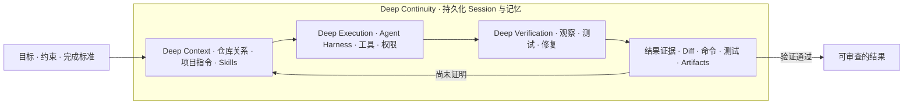
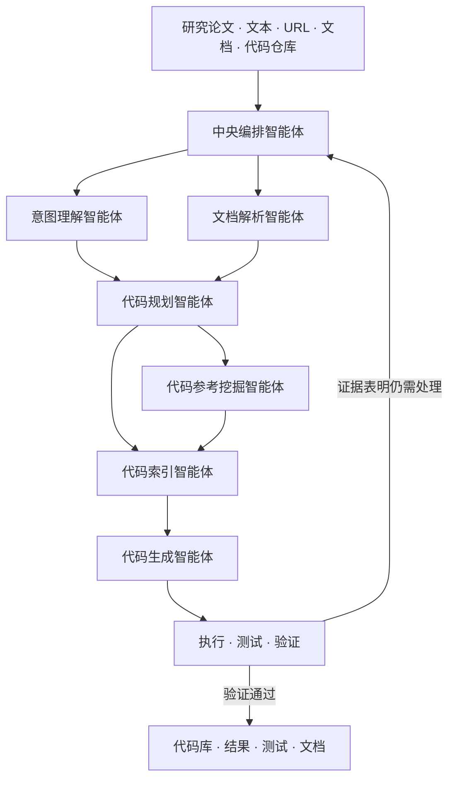

<div align="center">

<table style="border: none; margin: 0 auto; padding: 0; border-collapse: collapse;">
<tr>
<td align="center" style="vertical-align: middle; padding: 10px; border: none; width: 250px;">
  
</td>
<td align="left" style="vertical-align: middle; padding: 10px 0 10px 30px; border: none;">
  <pre style="font-family: 'Courier New', monospace; font-size: 16px; color: #0EA5E9; margin: 0; padding: 0; text-shadow: 0 0 10px #0EA5E9, 0 0 20px rgba(14,165,233,0.5); line-height: 1.2; transform: skew(-1deg, 0deg); display: block;">    ██████╗ ███████╗███████╗██████╗  ██████╗ ██████╗ ██████╗ ███████╗
    ██╔══██╗██╔════╝██╔════╝██╔══██╗██╔════╝██╔═══██╗██╔══██╗██╔════╝
    ██║  ██║█████╗  █████╗  ██████╔╝██║     ██║   ██║██║  ██║█████╗
    ██║  ██║██╔══╝  ██╔══╝  ██╔═══╝ ██║     ██║   ██║██║  ██║██╔══╝
    ██████╔╝███████╗███████╗██║     ╚██████╗╚██████╔╝██████╔╝███████╗
    ╚═════╝ ╚══════╝╚══════╝╚═╝      ╚═════╝ ╚═════╝ ╚═════╝ ╚══════╝</pre>
</td>
</tr>
</table>

<div align="center">
<a href="https://trendshift.io/repositories/14665" target="_blank"></a>
</div>

<!--  -->

#  DeepCode: 开源智能体编程

### *基于多智能体系统推进代码生成技术*

<!-- <p align="center">
  

  
  
  
</p> -->
<p>
  <a href="https://github.com/HKUDS/DeepCode/stargazers"></a>
  
  <a href="https://pypi.org/project/deepcode-hku/"></a>
</p>
<p>
  <a href="https://discord.gg/yF2MmDJyGJ"></a>
  <a href="https://github.com/HKUDS/DeepCode/issues/11"></a>
</p>
<div align="center">
  <div style="width: 100%; height: 2px; margin: 20px 0; background: linear-gradient(90deg, transparent, #00d9ff, transparent);"></div>
</div>

<div align="center">
  <a href="#快速开始" style="text-decoration: none;">
    
  </a>
</div>

<div align="center" style="margin-top: 10px;">
  <a href="README.md">
    
  </a>
  <a href="README_ZH.md">
    
  </a>
</div>

### 🖥️ **界面展示**

#### 🖥️ **命令行界面**

**基于终端的开发环境**

<div align="center">

  

  <div style="background: linear-gradient(135deg, #2D3748 0%, #4A5568 100%); border-radius: 12px; padding: 15px; margin: 15px 0; color: white;">
    <strong>🚀 高级终端体验</strong><br/>
    <small>⚡ 快速命令行工作流<br/>🔧 开发者友好界面<br/>📊 实时进度跟踪</small>
  </div>

*专业终端界面，适合高级用户和CI/CD集成*
</div>

旧浏览器界面已经移除。目前可以从源码运行新的 Tauri 2 桌面工作台；
正式打包发布仍在开发中。详见
[`P1 架构`](docs/P1_APP_SERVER_ARCHITECTURE.md)与
[`完整路线`](docs/TAURI_DESKTOP_REBUILD_PLAN.md)。

---

<div align="center">

### 🎬 **介绍视频**

<div style="margin: 20px 0;">
  <a href="https://youtu.be/PRgmP8pOI08" target="_blank">
    
  </a>
</div>

*🎯 **观看我们的完整介绍** - 了解DeepCode如何将研究论文和自然语言转换为生产就绪的代码*

<p>
  <a href="https://youtu.be/PRgmP8pOI08" target="_blank">
    
  </a>
</p>

</div>

---

> *"AI智能体将创意转化为生产就绪代码的地方"*

</div>

---

## 目录

- [新闻](#新闻)
- [DeepCode 中的 Deep](#deepcode-中的-deep)
- [核心能力](#核心能力)
  - [Agent Harness](#agent-harness)
  - [Loop Engineering](#loop-engineering)
  - [Context Engineering](#context-engineering)
  - [以证据判断完成](#以证据判断完成)
  - [持久化本地工作](#持久化本地工作)
  - [由用户控制的模型与 Skills](#由用户控制的模型与-skills)
  - [并行且可重复的工作](#并行且可重复的工作)
- [快速开始](#快速开始)
- [使用 DeepCode](#使用-deepcode)
- [Paper2Code](#paper2code)
  - [原始架构](#原始架构)
  - [研究结果](#研究结果)
- [开发](#开发)
- [社区与研究](#社区与研究)
- [许可证](#许可证)

<p align="center">
  
</p>

## 新闻

**2026-07-20 · Session 级模型控制与共享 Skills**

- 命名 LLM 连接只需配置一次，即可在整个 DeepCode 中使用。
- 为后续 Turn 切换连接或模型时，不会丢失之前的完整对话。
- 无论任务从哪里启动，都能发现、导入、启用和选择同一套项目级或用户级 Skills。

**2026-07-17 · 持久化 Session 导航与回放**

- 每个 Project 管理自己的可折叠 Session 列表，同时仍可跨目录发现更早的记录。
- 长对话采用增量回放，不再因为把全部历史作为一条超大消息传输而失败。
- 批准、变更审查、测试与 Artifacts 始终保留在产生它们的任务中。

**2026-07-10 · Loop Engineering 与并行 Agent**

- 给出目标和验证命令，DeepCode 可以在有边界的轮次中完成理解、实现、
  测试与修复。
- 将聚焦任务委派给隔离 worktree 中的 Agent，并在集成前明确暴露冲突。

<details>
<summary><strong>更早的里程碑</strong></summary>

- **2026-07-08 · 持久化 Sessions 与记忆。** Session 历史可以跨重启恢复；
  项目长期指令可以写入 `AGENTS.md` 或 `DEEPCODE.md`，持久笔记跟随工作区保存。
- **2026-07-08 · 通用 Coding Agent。** 自由对话式 TUI、原生文件与 Shell 工具、
  无头执行、上下文压缩和跨目录恢复，建立了当前产品基础。
- **2026-07-04 · Agent Harness 基础。** 统一执行约束、三值权限、
  敏感路径保护、平台 Sandbox 与标准化事件，使本地执行真正可监督。
- 重构前的完整更新记录保存在
  [旧版中文 README](docs/archive/README_ZH_LEGACY_2026-07-20.md)。

</details>

## DeepCode 中的 Deep

这个名字表达的是产品行为，而不是为了复杂而复杂。DeepCode 不会停在一段
看似合理的回答或一个孤立 Patch。它会沿着任务深入仓库关系、真实执行、
验证失败，以及未来继续工作所需要的上下文。

| 深度                  | 它代表什么                                                          |
| --------------------- | ------------------------------------------------------------------- |
| **Deep Context**      | 将文件与跨文件关系、项目指令、已选 Skills、历史和记忆放在一起理解。 |
| **Deep Execution**    | 通过带权限、批准和工作区边界的 Agent Harness 操作真实文件与命令。   |
| **Deep Verification** | 把测试、诊断和失败重新送回任务，而不是停在一段看起来可信的回答。    |
| **Deep Continuity**   | 跨时间、目录和模型切换保留 Session、关键决策、证据与恢复状态。      |

Paper2Code 最早确立了这种深度：从论文理解开始，经过参考挖掘、代码实现，
一直走到真实验证。现在的通用 Coding Agent 将同一思路扩展到了日常仓库工作。



这才是产品的工作模型。使用界面只决定用户如何进入和观察它。

## 核心能力

四种“深度”通过下面这些产品能力落到实际工作中。

<p align="center">
  
</p>

### Agent Harness

Harness 是 DeepCode 将模型回答转化为“用户可以监督的真实工作”的部分。
它为 Agent 提供原生读取、搜索、编辑、补丁、Shell、测试与委派能力，同时
让每次动作都经过同一套执行约束。

- 工具活动以明确进度展示，而不是藏在一个持续旋转的等待状态后面；
- 权限判断只有清晰的三种结果：`allow`、`ask` 或 `deny`；
- 即使处于宽松模式，敏感凭证路径也始终不可访问；
- Shell 工作通过当前平台可用的 macOS 或 Linux Sandbox 限制写入范围；
- 中断或崩溃后的任务会被安全收束，不会静默重放带有副作用的操作。

### Loop Engineering

一次看起来不错的回答，并不等于真正完成了修改。Loop Engineering 让
DeepCode 围绕可观察的完成标准工作：一条测试命令、Build、Lint，或者用户
指定的其他验证。

每一轮都会基于最新状态继续理解、执行并运行验证，再由结果决定下一步。
最大轮数和定时执行上限保证 Loop 不会无限运行；Session 历史与项目记忆则
让多轮推理保持连续。

### Context Engineering

DeepCode 从仓库构建上下文，而不是依赖一条巨大的 Prompt。它把文件与搜索
结果、项目长期指令、已选择的 Skills、Session 历史和持久化工作区笔记组合
起来。长历史会根据当前模型的上下文窗口进行压缩，使最新证据保持有效，同时
不切断任务连续性。

当仓库发生变化、命令产生新证据时，上下文也会随之更新，让规划、实现与验证
始终对应最新的可观察状态。

### 以证据判断完成

DeepCode 不会把一段流畅回答当作任务已经完成的证明。完成结论应当由任务
真正可以产生的结果支撑：

- 可以审查的 Diff 或生成文件；
- 命令输出、诊断信息或测试结果；
- 当输出不适合直接放进对话时保存的 Artifact；
- 将用户目标与结果证据连接起来的简洁说明。

如果验证失败，失败结果会成为下一轮输入。如果某个边界阻止继续完成，该边界
会保持可见，而不会被错误报告为成功。

### 持久化本地工作

可以从任意仓库启动 DeepCode。Sessions 统一保存在
`~/.deepcode/sessions/`，按原始工作区建立索引，并可跨目录发现。用户可以
在重启后恢复，或明确选择另一个工作目录继续，而不会改写 Session 记录的
原始来源。

Session 是完整对话，Turn 是其中一次已接收的工作单元。切换模型只影响后续
Turn，因此之前的工作保持可读，每次重试也能明确对应产生它的执行配置。

### 由用户控制的模型与 Skills

DeepCode 不绑定单一托管模型。命名连接可以指向 OpenRouter、OpenAI、
Anthropic、已支持的 Provider、OpenAI-compatible 网关或本地 endpoint。
凭证留在用户级存储中；项目可以选择连接，但不会取得密钥所有权。

Skills 是可以复用的工作流指令。它们既可以随项目保存，也可以进入用户库；
用户可以从本地目录导入，并只为当前 Turn 选择真正需要的 Skills。所有执行
方式都会解析同一份目录，而且 Skill 永远不能提高自己的权限。

### 并行且可重复的工作

DeepCode 可以把有边界的任务委派给隔离 Git worktree 中的 Agent。不同任务
不共享同一个可变 checkout，集成时会明确检测冲突。Automations 则通过与手动
Turn 相同的 Session、模型、权限和恢复规则提交周期性工作。

## 快速开始

### 1. 安装与初始化

```bash
pip install deepcode-hku
deepcode init
```

`deepcode init` 会在 `~/.deepcode/` 下创建用户级配置。完成后，可以从任意
项目目录直接启动 `deepcode`。

### 2. 连接模型服务

```bash
deepcode provider set personal-openrouter \
  --template openrouter \
  --label "OpenRouter · Personal" \
  --api-key

deepcode provider test personal-openrouter
deepcode provider models personal-openrouter --refresh
```

`--api-key` 使用不回显的安全输入。已保存的密钥进入仅当前用户可读的
`~/.deepcode/credentials.json`，不会暴露给客户端，也不会写入 Session 历史。

### 3. 开始编码

```bash
deepcode -c personal-openrouter -m moonshotai/kimi-k3 --effort low
```

也可以无头执行单个任务：

```bash
deepcode exec "修复失败的测试，并解释根本原因" \
  --connection personal-openrouter \
  --model moonshotai/kimi-k3 \
  --effort low \
  --json
```

用户可以选择适合自己的使用界面。`deepcode` 会打开交互式 CLI；同一份
Sessions 也可以在 Desktop 中打开。若要从源码运行 Desktop，请先安装
Node.js 22+、Rust stable 和 Tauri 对应平台所需的系统依赖，然后运行：

```bash
cd desktop
npm ci
npm run tauri -- dev
```

打开 **Settings → Connections** 配置模型服务，然后在 Session 输入框中
选择连接与模型。

> 使用界面只改变工作的呈现方式，不改变背后的 Agent、策略、配置和 Session
> 历史。Desktop 正式安装包仍在开发中。

## 使用 DeepCode

### Sessions

```text
/new [标题]              创建新 Session
/resume                 列出当前目录的 Sessions
/resume all             列出所有已记录目录的 Sessions
/resume <id>            恢复一个 Session
/model [连接] [模型ID]    查看或修改后续 Turn 的模型
/effort [auto|off|档位]  查看或修改后续 Turn 的 Thinking 强度
/clear                  清空当前内存上下文
@src/main.py            将文件附加到下一条提示
```

直接启动或恢复：

```bash
deepcode -w ./my-project
deepcode --resume <session-id>
```

无论由哪个客户端打开，Session 文件始终保存在
`~/.deepcode/sessions/`。显式跨目录恢复只改变当前执行上下文，不会改写
Session 中记录的原始工作目录。

### Connections 与模型

常用命令：

```bash
deepcode provider list
deepcode provider test <连接ID>
deepcode provider models <连接ID> --refresh
deepcode provider remove <连接ID>
```

使用环境变量而不是凭证文件：

```bash
deepcode provider set work-openrouter \
  --template openrouter \
  --api-key-env OPENROUTER_API_KEY
```

接入任意 OpenAI-compatible endpoint：

```bash
deepcode provider set company-proxy \
  --template custom \
  --adapter openai_compat \
  --api-base https://llm.example.com/v1 \
  --catalog openai \
  --api-key
```

内置模板包括 `openrouter`、`openai`、`anthropic`、`deepseek`、`gemini`、
`zhipu`、`dashscope`、`ollama`、`vllm` 和 `custom`。

若要为 DeepCode 设置统一默认值，请修改用户级
`~/.deepcode/deepcode_config.json`：

```json
{
  "agents": {
    "defaults": {
      "connection": "personal-openrouter",
      "model": "moonshotai/kimi-k3",
      "reasoningEffort": "low"
    }
  }
}
```

项目配置可以选择用户已有的连接，但不能替换它的 endpoint、adapter、
headers 或凭证。

Thinking 档位来自所选模型的 catalog，而不是 DeepCode 内的一份全局硬编码
列表。`auto` 使用 provider/model 默认值；只有模型允许关闭时才提供 `off`。
Session 内的切换只影响后续 Turn，不会改写已有历史。DeepCode 不会把原始
chain-of-thought 渲染成助手正文；界面最多显示 provider 明确提供的安全摘要，
签名或加密的续接状态只会私下保存在 canonical Session 中。

### Skills

DeepCode 会同时发现 DeepCode 与 Claude-compatible Skill 目录：

```text
.deepcode/skills/        项目级 DeepCode Skills
.claude/skills/          项目级 Claude-compatible Skills
~/.deepcode/skills/      用户级 DeepCode Skills
~/.claude/skills/        用户级 Claude-compatible Skills
```

通过 CLI 管理：

```bash
deepcode skill list
deepcode skill show <ID或名称>
deepcode skill import ./my-skill --scope project
deepcode skill disable <skill-id> --scope project
```

为下一次交互式 Turn 选择 Skills：

```text
/skills
/skill <ID或名称>
/skill remove <ID或名称>
/skill clear
```

无头任务可以重复使用 `--skill`：

```bash
deepcode exec "检查本次变更是否引入安全问题" \
  --skill security-review \
  --skill test-strategy
```

Skill 只能提供工作流指导，不能授予权限，也不能绕过 Project trust、
Sandbox、批准或工具策略。

### 安全与执行

DeepCode 将执行安全视为产品边界，而不是客户端确认框：

- Project 在交互式 Agent 执行前需要明确的 trust。
- 权限决策分为 `allow`、`ask` 和 `deny`。
- Approval 会恢复被暂停的同一次工具调用。
- 所有权限模式都不能访问受保护的敏感凭证路径。
- Shell 与代码进程在超时、中断或关闭时会按 DeepCode 所有的进程树终止。
- 崩溃恢复会收敛未完成的 Turn，但不会自动重放副作用。

### 长期任务

让 Agent 持续工作，直到验证命令通过：

```bash
deepcode loop "实现指定功能" \
  --test-cmd "python -m pytest -q" \
  --max-rounds 6
```

执行有边界的定时任务：

```bash
deepcode schedule loop "修复失败的测试套件" \
  --test-cmd "python -m pytest -q" \
  --every 3600 \
  --max-runs 5
```

Automation 通过正常 Turn 路径提交工作，因此手动和定时执行都遵守同一套
Session、权限、模型和恢复规则。

## Paper2Code

Paper2Code 是 DeepCode 的研究起点，也是当前面向科研代码复现的专业工作流。
通用 Coding Agent 扩展了产品边界，但没有替代或简化 Paper2Code 的原始设计。

它的核心思路始终不变：论文复现不是一次性代码生成任务。一个中央编排智能体
负责协调多个边界清晰的专业角色，依次完成来源理解、复现规划、参考发现与索引、
代码实现以及结果验证。

### 原始架构



各专业角色继续保持原系统中清晰的职责分离：

| 角色                   | 职责                                                                                 |
| ---------------------- | ------------------------------------------------------------------------------------ |
| **中央编排智能体**     | 判断整体进度、选择下一阶段、协调专业角色，并在新证据出现时调整计划。                 |
| **意图理解智能体**     | 将用户目标转化为明确的功能需求、技术约束与可执行的任务分解。                         |
| **文档解析智能体**     | 处理论文与技术文档，提取算法、公式、方法、假设和实现要求。                           |
| **代码规划智能体**     | 把已理解的方法转换为实现路线、模块边界、依赖、接口与验证目标。                       |
| **代码参考挖掘智能体** | 发现相关仓库、库与实现模式，并判断它们的相关性、兼容性和集成价值。                   |
| **代码索引智能体**     | 将检索到的代码组织为可搜索的语义索引与知识图谱，使生成阶段可以恢复关键组件及其关系。 |
| **代码生成智能体**     | 综合计划与证据形成可执行实现，并生成可复现结果所需的接口、测试和文档。               |

四个核心思想把这些角色连接为一个整体：

- **智能编排。** 中央 Agent 根据任务状态选择并回访不同阶段，而不是把论文复现
  当作固定的一次性 Prompt 链。
- **文档与意图对齐。** 论文、规格、URL 与附件会先转化为明确实现要求，再进入
  编码阶段。
- **记忆与 CodeRAG。** 长文档与参考仓库经过分段、索引和按需检索，以有边界的
  上下文进入模型，而不是反复塞入整个窗口。
- **迭代验证。** 执行、测试与真实失败会回流到规划和实现阶段，直到交付结果
  拥有可以检查的证据。

配套工具层同样延续这一职责划分：

| 层次         | 作用                                                      |
| ------------ | --------------------------------------------------------- |
| 文档导入     | 获取并规范化论文、URL、PDF、DOCX、演示文稿、文本与 HTML。 |
| 文档分段     | 将大型技术材料切分为语义连贯、可恢复的分析单元。          |
| 参考发现     | 搜索候选仓库与支持性实现。                                |
| 代码参考索引 | 为外部与本地代码建立可搜索上下文，并保留跨文件关系。      |
| 实现执行     | 读写文件、运行 Shell 或 Python、检查项目结构并记录过程。  |
| 验证与交付   | 运行测试、保存结果，并交付代码库、文档与 Artifacts。      |

新版产品围绕这套流程增加了持久化计划、显式计划审查、检查点、有边界重试与
交互式检查能力。这些变化增强了恢复和监督，但没有改变 Paper2Code 的架构
职责与推理顺序。

<!--
README 图片占位 — PAPER2CODE WORKFLOW

请在以下路径加入新版 Paper2Code 工作流截图：
  assets/readme/paper2code-workflow.png

截图应包含：
- Workflow 计划或检查点状态；
- 一项真实验证结果；
- Artifact 或 Inspector 界面。

不要继续使用旧浏览器 UI 截图。
-->

### 研究结果

DeepCode 原始研究使用
[PaperBench](https://openai.com/index/paperbench/) 评估科研代码复现能力。
该基准要求 Agent 复现 20 篇 ICML 2024 论文，共包含 8,316 个可评分组件。

<p align="center">
  
</p>

| 评估子集        | DeepCode | 论文中报告的对比结果        | 差值           |
| --------------- | -------- | --------------------------- | -------------- |
| 人类专家子集    | 75.9%    | 论文中最佳人类基线：72.4%   | +3.5 个百分点  |
| 商业 Agent 子集 | 84.8%    | 论文中最佳商业 Agent：58.7% | +26.1 个百分点 |
| 科研编程        | 73.5%    | PaperCoder：51.1%           | +22.4 个百分点 |
| LLM Agent 基线  | 73.5%    | 论文中最佳 LLM Agent：43.3% | +30.2 个百分点 |

以上是原论文报告的 PaperBench 专项结果，不代表通用编程基准，也不代表对
持续更新中的商业产品进行实时比较。

评估方法、范围、模型和基线详情请阅读
[论文](https://arxiv.org/abs/2512.07921)。

旧版演示继续作为历史案例保留：

- [Paper2Code 演示](https://www.youtube.com/watch?v=MQZYpLkzsbw)
- [前端实现演示](https://www.youtube.com/watch?v=78wx3dkTaAU)
- [项目介绍视频](https://youtu.be/PRgmP8pOI08)

## 开发

### 源码安装

```bash
git clone https://github.com/HKUDS/DeepCode.git
cd DeepCode

curl -LsSf https://astral.sh/uv/install.sh | sh
uv venv --python=3.13
source .venv/bin/activate
uv pip install -r requirements.txt
pip install -e .
```

Windows 请使用 `.venv\Scripts\activate` 激活环境。

### 验证

```bash
uvx pre-commit run --all-files
PYTHONPATH=. pytest -q

cd desktop
npm run lint
npm test -- --run
npm run build
```

Desktop 打包、Rust 检查、签名和发布流程请参考
[`desktop/README.md`](desktop/README.md) 与
[Desktop 发布手册](docs/DESKTOP_RELEASE_RUNBOOK.md)。

<details>
<summary><strong>贡献者架构资料</strong></summary>

| 主题                       | 文档                                                          |
| -------------------------- | ------------------------------------------------------------- |
| Agent 执行与批准           | [P2 Agent execution](docs/P2_AGENT_EXECUTION_ARCHITECTURE.md) |
| Desktop Sidecar 与生命周期 | [P3 Desktop runtime](docs/P3_DESKTOP_RUNTIME_ARCHITECTURE.md) |
| Git 审查、文件、终端与测试 | [P4 Code workbench](docs/P4_CODE_WORKBENCH_ARCHITECTURE.md)   |
| 持久化 Paper2Code 工作流   | [P5 Paper2Code](docs/P5_PAPER2CODE_ARCHITECTURE.md)           |
| 中央 Session 与跨目录恢复  | [P6 Session alignment](docs/P6_SESSION_ALIGNMENT_REVIEW.md)   |
| Skills 身份、安全与持久化  | [Skills architecture](docs/SKILLS_PRODUCT_ARCHITECTURE.md)    |
| Desktop 产品与交互模型     | [Desktop UI specification](docs/DESKTOP_PRODUCT_UI_SPEC.md)   |
| 隐私与诊断                 | [Privacy contract](docs/PRIVACY_AND_DIAGNOSTICS.md)           |

</details>

重构前的中文 README 保存在
[`docs/archive/README_ZH_LEGACY_2026-07-20.md`](docs/archive/README_ZH_LEGACY_2026-07-20.md)。
新版产品图片占位使用同一份
[截图要求](assets/readme/README.md)。

## 社区与研究

<p align="center">
  <a href="https://star-history.com/#HKUDS/DeepCode&Date">
    <picture>
      <source media="(prefers-color-scheme: dark)" srcset="https://api.star-history.com/svg?repos=HKUDS/DeepCode&type=Date&theme=dark" />
      <source media="(prefers-color-scheme: light)" srcset="https://api.star-history.com/svg?repos=HKUDS/DeepCode&type=Date" />
      
    </picture>
  </a>
</p>

如果 DeepCode 对您的研究有所帮助，请引用：

```bibtex
@misc{li2025deepcodeopenagenticcoding,
  title         = {DeepCode: Open Agentic Coding},
  author        = {Zongwei Li and Zhonghang Li and Zirui Guo and Xubin Ren and Chao Huang},
  year          = {2025},
  eprint        = {2512.07921},
  archivePrefix = {arXiv},
  primaryClass  = {cs.SE},
  url           = {https://arxiv.org/abs/2512.07921}
}
```

## 许可证

DeepCode 采用 [MIT License](LICENSE)。
