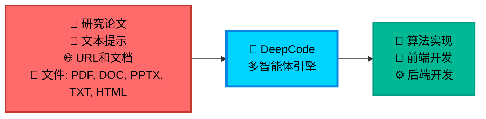

<!-- 归档于 2026-07-20 产品 README 重构之前。 -->

<div align="center">

<table style="border: none; margin: 0 auto; padding: 0; border-collapse: collapse;">
<tr>
<td align="center" style="vertical-align: middle; padding: 10px; border: none; width: 250px;">
  
</td>
<td align="left" style="vertical-align: middle; padding: 10px 0 10px 30px; border: none;">
  <pre style="font-family: 'Courier New', monospace; font-size: 16px; color: #0EA5E9; margin: 0; padding: 0; text-shadow: 0 0 10px #0EA5E9, 0 0 20px rgba(14,165,233,0.5); line-height: 1.2; transform: skew(-1deg, 0deg); display: block;">    ██████╗ ███████╗███████╗██████╗  ██████╗ ██████╗ ██████╗ ███████╗
    ██╔══██╗██╔════╝██╔════╝██╔══██╗██╔════╝██╔═══██╗██╔══██╗██╔════╝
    ██║  ██║█████╗  █████╗  ██████╔╝██║     ██║   ██║██║  ██║█████╗
    ██║  ██║██╔══╝  ██╔══╝  ██╔═══╝ ██║     ██║   ██║██║  ██║██╔══╝
    ██████╔╝███████╗███████╗██║     ╚██████╗╚██████╔╝██████╔╝███████╗
    ╚═════╝ ╚══════╝╚══════╝╚═╝      ╚═════╝ ╚═════╝ ╚═════╝ ╚══════╝</pre>
</td>
</tr>
</table>

<div align="center">
<a href="https://trendshift.io/repositories/14665" target="_blank"></a>
</div>

<!--  -->

#  DeepCode: 开源智能体编程

### *基于多智能体系统推进代码生成技术*

<!-- <p align="center">
  

  
  
  
</p> -->
<p>
  <a href="https://github.com/HKUDS/DeepCode/stargazers"></a>
  
  <a href="https://pypi.org/project/deepcode-hku/"></a>
</p>
<p>
  <a href="https://discord.gg/yF2MmDJyGJ"></a>
  <a href="https://github.com/HKUDS/DeepCode/issues/11"></a>
</p>
<div align="center">
  <div style="width: 100%; height: 2px; margin: 20px 0; background: linear-gradient(90deg, transparent, #00d9ff, transparent);"></div>
</div>

<div align="center">
  <a href="#-快速开始" style="text-decoration: none;">
    
  </a>
</div>

<div align="center" style="margin-top: 10px;">
  <a href="../../README.md">
    
  </a>
  <a href="../../README_ZH.md">
    
  </a>
</div>

### 🖥️ **界面展示**

#### 🖥️ **命令行界面**
**基于终端的开发环境**

<div align="center">

  

  <div style="background: linear-gradient(135deg, #2D3748 0%, #4A5568 100%); border-radius: 12px; padding: 15px; margin: 15px 0; color: white;">
    <strong>🚀 高级终端体验</strong><br/>
    <small>⚡ 快速命令行工作流<br/>🔧 开发者友好界面<br/>📊 实时进度跟踪</small>
  </div>

  *专业终端界面，适合高级用户和CI/CD集成*
</div>

旧浏览器界面已经移除。目前可以从源码运行新的 Tauri 2 桌面工作台；
正式打包发布仍在开发中。详见
[`P1 架构`](../P1_APP_SERVER_ARCHITECTURE.md)。

---

<div align="center">

### 🎬 **介绍视频**

<div style="margin: 20px 0;">
  <a href="https://youtu.be/PRgmP8pOI08" target="_blank">
    
  </a>
</div>

*🎯 **观看我们的完整介绍** - 了解DeepCode如何将研究论文和自然语言转换为生产就绪的代码*

<p>
  <a href="https://youtu.be/PRgmP8pOI08" target="_blank">
    
  </a>
</p>

</div>

---


> *"AI智能体将创意转化为生产就绪代码的地方"*

</div>

---

## 📑 目录

- [📰 新闻](#-新闻)
- [🚀 核心特性](#-核心特性)
- [🏗️ 架构](#️-架构)
- [📊 实验结果](#-实验结果)
- [🚀 快速开始](#-快速开始)
- [💡 示例](#-示例)
  - [🎬 实时演示](#-实时演示)
- [⭐ 星标历史](#-星标历史)
- [📄 许可证](#-许可证)

---

## 📰 新闻

**[2026-07-20] CLI 与 Desktop 共享 LLM 连接，支持 Session 内切换模型**

- **一次配置，两端共用。** CLI 与 Desktop 现在共享命名连接、Provider 路由、
  模型目录和同一套 Agent 运行时。
- **凭证保持私密。** 已保存的 API Key 进入用户级凭证文件，不会返回 Desktop，
  也不会写入 Session 历史。
- **切换模型不丢上下文。** 同一个 Session 可以为后续 Turn 切换连接与模型，
  完整历史保持不变；每个已接收的 Turn 都保留独立且不可变的执行快照。

---

**[2026-07-10] 循环工程:给它一个目标,它自己跑到测试通过**

- **自主编码循环。** 给 DeepCode 一个目标和一条测试命令,它就自己干活、跑测试、反复修改,直到测试通过。
- **会自我整理的记忆。** agent 会定期清理自己的笔记,让记忆在多会话中保持清晰。
- **可定时运行。** 按间隔启动一个循环或一次记忆整理,带合理的停止条件,绝不失控。

---

**[2026-07-08] 持久会话与记忆**

- **agent 跨会话有记忆。** 在项目根放一个 `AGENTS.md`（或 `DEEPCODE.md`）写长期指令；持久笔记保存在 `.deepcode/memory/`。
- **会话跨重启恢复。** 工作目录、消息、标题和任务引用保存在 `~/.deepcode/sessions/`，可从 TUI 恢复。

---

**[2026-07-08] 通用编码 agent：交互式 CLI 与原生工具**

- **在终端里直接和 DeepCode 对话。** `deepcode` 进入自由多轮编码对话——用自然语言描述任意任务，实时看到流式回复、文件修改与命令执行进度卡。`/new`、`/resume`、`/model`、`/clear`、`/help` 随时掌控，`@路径` 直接附加文件。（替代原菜单式 CLI。）
- **改代码一次到位。** 内置 `read` / `write` / `edit` / `apply_patch` / `bash` / `grep` / `glob` 工具:模糊匹配容忍空白缩进漂移、多文件补丁原子落盘、写入后自动诊断并当场修复。
- **一条命令跑任务。** `deepcode exec "任务" --json` 端到端执行并输出机器可读事件流，可直接接入 CI 与自动化脚本。
- **聊多久都稳。** 上下文窗口按模型自动解析、历史自动压缩,长对话不崩;会话经 SQLite 索引,列表与恢复即时响应。

---

<details>
<summary><strong>更早的更新</strong></summary>

🧭 **[2026-05-01] OpenRouter 模型选择器、session 清理与工作流体验增强**

- 🧠 **OpenRouter 模型目录支持。** DeepCode 可以获取并缓存 OpenRouter 模型元数据，支持 `z-ai/glm-5.1` 等精确模型 id。
- 🔄 **运行时模型切换。** 修改 `deepcode_config.json` 后，新启动的 workflow 会使用新的 provider/model 组合。
- 🛡️ **工作流稳定性修复。** 上传阶段会拒绝 Git LFS pointer 文件；取消任务会及时中断后端工作；浏览器中的过期 session id 会自动恢复；planner 在模型输出错误的工具调用/延迟执行文本时会回退到最小合法 plan；文档分割阶段跳过额外质量验证 LLM 调用，减少卡在 50% 的概率。

---

🗂️ **[2026-04-28] 持久化 session 与双层结构化日志**

- 🆕 **Session 现在会持久化。** CLI session 默认保存在 `~/.deepcode/sessions/<id>/`（可用 `DEEPCODE_SESSIONS_DIR` 覆盖），使用 JSONL 存储并由 SQLite 索引。
- 🔄 **恢复历史任务。** TUI 可以通过 `/resume` 或 `--resume <id>` 恢复历史对话。
- 💻 **CLI 交互增强。** 进入 `python cli/main_cli.py` 后，可以在主菜单输入 `/resume` 打开历史 session 选择器，`/new [title]` 新建并切换 session，`/session` 查看当前 session，`/help` 查看命令。也支持 Cursor/Codex 风格的内联输入：`@/path/to/paper.pdf`、`@"C:\path with spaces\paper.pdf"`、`@https://...`。
- 📜 **双层结构化日志。** 全局日志写入 `logs/server-YYYYMMDD.jsonl`；每个任务的日志写入 `deepcode_lab/tasks/<task_id>/logs/{system,llm,mcp}.jsonl`。所有 `loguru.logger` 调用都会通过 contextvar 自动带上 `task_id` / `session_id`，LLM/MCP 调用还会记录耗时、token、请求/响应摘要。
- 🧹 **清理旧实现。** 删除 `utils/simple_llm_logger.py`、`utils/dialogue_logger.py`，原内存版 `services/session_service.py` 改为 `core.sessions.SessionStore` 的 thin facade。

---

🎉 **[2025-10-28] DeepCode在PaperBench上达到最先进水平！**

DeepCode在OpenAI的PaperBench Code-Dev所有类别中创造新基准：

- 🏆 **超越人类专家**: **75.9%** (DeepCode) vs 顶级机器学习博士 72.4% (+3.5%)。
- 🥇 **超越最先进商业代码智能体**: **84.8%** (DeepCode) vs 领先商业代码智能体 (+26.1%) (Cursor, Claude Code, 和 Codex)。
- 🔬 **推进科学编程**: **73.5%** (DeepCode) vs PaperCoder 51.1% (+22.4%)。
- 🚀 **击败LLM智能体**: **73.5%** (DeepCode) vs 最佳LLM框架 43.3% (+30.2%)。

</details>

---

## 🚀 核心特性

<br/>

<table align="center" width="100%" style="border: none; table-layout: fixed;">
<tr>
<td width="30%" align="center" style="vertical-align: top; padding: 20px;">

<div style="height: 80px; display: flex; align-items: center; justify-content: center;">
<h3 style="margin: 0; padding: 0;">🚀 <strong>论文转代码</strong></h3>
</div>

<div align="center" style="margin: 15px 0;">
  
</div>

<div style="height: 80px; display: flex; align-items: center; justify-content: center;">
<p align="center"><strong>复杂算法的自动化实现</strong></p>
</div>

<div style="height: 60px; display: flex; align-items: center; justify-content: center;">
<p align="center">轻松将研究论文中的复杂算法转换为<strong>高质量</strong>、<strong>生产就绪</strong>的代码，加速算法复现。</p>
</div>


</td>
<td width="30%" align="center" style="vertical-align: top; padding: 20px;">

<div style="height: 80px; display: flex; align-items: center; justify-content: center;">
<h3 style="margin: 0; padding: 0;">🎨 <strong>文本转Web</strong></h3>
</div>

<div align="center" style="margin: 15px 0;">
  
</div>

<div style="height: 80px; display: flex; align-items: center; justify-content: center;">
<p align="center"><strong>自动化前端Web开发</strong></p>
</div>

<div style="height: 60px; display: flex; align-items: center; justify-content: center;">
<p align="center">将纯文本描述转换为<strong>功能完整</strong>、<strong>视觉美观</strong>的前端Web代码，快速创建界面。</p>
</div>


</td>
<td width="30%" align="center" style="vertical-align: top; padding: 20px;">

<div style="height: 80px; display: flex; align-items: center; justify-content: center;">
<h3 style="margin: 0; padding: 0;">⚙️ <strong>文本转后端</strong></h3>
</div>

<div align="center" style="margin: 15px 0;">
  
</div>

<div style="height: 80px; display: flex; align-items: center; justify-content: center;">
<p align="center"><strong>自动化后端开发</strong></p>
</div>

<div style="height: 60px; display: flex; align-items: center; justify-content: center;">
<p align="center">从简单的文本输入生成<strong>高效</strong>、<strong>可扩展</strong>和<strong>功能丰富</strong>的后端代码，简化服务器端开发。</p>
</div>


</td>
</tr>
</table>

<br/>

---

## 📊 实验结果

<div align="center">
    <br>
</div>
<br/>

我们在[*PaperBench*](https://openai.com/index/paperbench/)基准测试（由OpenAI发布）上评估**DeepCode**，这是一个严格的测试平台，要求AI智能体从头独立复现20篇ICML 2024论文。该基准包含8,316个可评分组件，使用带有分层权重的SimpleJudge进行评估。

我们的实验将DeepCode与四个基线类别进行比较：**(1) 人类专家**，**(2) 最先进商业代码智能体**，**(3) 科学代码智能体**，以及 **(4) 基于LLM的智能体**。

### ① 🧠 人类专家表现（顶级机器学习博士）

**DeepCode: 75.9% vs. 顶级机器学习博士: 72.4% (+3.5%)**

DeepCode在3篇论文的人类评估子集上达到**75.9%**，**超越3次人类专家基线（72.4%）+3.5个百分点**。这表明我们的框架不仅匹配而且超越了专家级代码复现能力，代表了自主科学软件工程的重要里程碑。

### ② 💼 最先进商业代码智能体

**DeepCode: 84.8% vs. 最佳商业智能体: 58.7% (+26.1%)**

在5篇论文的子集上，DeepCode大幅超越领先的商业编码工具：
- Cursor: 58.4%
- Claude Code: 58.7%
- Codex: 40.0%
- **DeepCode: 84.8%**

这代表了相对于领先商业代码智能体的**+26.1%改进**。所有商业智能体都使用Claude Sonnet 4.5或GPT-5 Codex-high，突出了**DeepCode的卓越架构**——而非基础模型能力——推动了这一性能差距。

### ③ 🔬 科学代码智能体

**DeepCode: 73.5% vs. PaperCoder: 51.1% (+22.4%)**

与最先进的科学代码复现框架PaperCoder（**51.1%**）相比，DeepCode达到**73.5%**，展示了**+22.4%的相对改进**。这一显著差距验证了我们结合规划、分层任务分解、代码生成和迭代调试的多模块架构优于简单的管道式方法。

### ④ 🤖 基于LLM的智能体

**DeepCode: 73.5% vs. 最佳LLM智能体: 43.3% (+30.2%)**

DeepCode显著超越所有测试的LLM智能体：
- Claude 3.5 Sonnet + IterativeAgent: 27.5%
- o1 + IterativeAgent (36小时): 42.4%
- o1 BasicAgent: 43.3%
- **DeepCode: 73.5%**

相对于表现最佳的LLM智能体的**+30.2%改进**表明，复杂的智能体框架，而非延长的推理时间或更大的模型，对于复杂的代码复现任务至关重要。

---

### 🎯 **自主多智能体工作流**

**面临的挑战**:

- 📄 **实现复杂性**: 将学术论文和复杂算法转换为可运行代码需要大量技术投入和领域专业知识

- 🔬 **研究瓶颈**: 研究人员将宝贵时间花在算法实现上，而不是专注于核心研究和发现工作

- ⏱️ **开发延迟**: 产品团队在概念和可测试原型之间经历长时间等待，减慢创新周期

- 🔄 **重复编码**: 开发者重复实现相似的模式和功能，而不是基于现有解决方案构建

**DeepCode** 通过为常见开发任务提供可靠的自动化来解决这些工作流程低效问题，简化从概念到代码的开发工作流程。

<div align="center">



</div>

---

## 🏗️ 架构

### 📊 **系统概述**

**DeepCode** 是一个AI驱动的开发平台，自动化代码生成和实现任务。我们的多智能体系统处理将需求转换为功能性、结构良好代码的复杂性，让您专注于创新而非实现细节。

🎯 **技术能力**:

🧬 **研究到生产流水线**<br>
多模态文档分析引擎，从学术论文中提取算法逻辑和数学模型。生成优化的实现，使用适当的数据结构，同时保持计算复杂度特征。

🪄 **自然语言代码合成**<br>
使用在精选代码库上训练的微调语言模型进行上下文感知代码生成。在支持多种编程语言和框架的同时保持模块间架构一致性。

⚡ **自动化原型引擎**<br>
智能脚手架系统，生成包括数据库模式、API端点和前端组件的完整应用程序结构。使用依赖分析确保从初始生成开始的可扩展架构。

💎 **质量保证自动化**<br>
集成静态分析与自动化单元测试生成和文档合成。采用AST分析进行代码正确性检查和基于属性的测试进行全面覆盖。

🔮 **CodeRAG集成系统**<br>
高级检索增强生成，结合语义向量嵌入和基于图的依赖分析。从大规模代码语料库中自动发现最优库和实现模式。

---

### 🔧 **核心技术**

- 🧠 **智能编排智能体**: 协调工作流阶段和分析需求的中央决策系统。采用动态规划算法，根据不断发展的项目复杂性实时调整执行策略。为每个实现步骤动态选择最优处理策略。 <br>

- 💾 **高效内存机制**: 高效管理大规模代码上下文的高级上下文工程系统。实现分层内存结构，具有智能压缩功能，用于处理复杂代码库。该组件实现实现模式的即时检索，并在扩展开发会话中保持语义一致性。 <br>

- 🔍 **高级CodeRAG系统**: 分析跨存储库复杂相互依赖关系的全局代码理解引擎。执行跨代码库关系映射，从整体角度理解架构模式。该模块利用依赖图和语义分析在实现过程中提供全局感知的代码建议。

---

### 🤖 **DeepCode的多智能体架构**:

- **🎯 中央编排智能体**: 编排整个工作流程执行并做出战略决策。基于输入复杂性分析协调专门智能体。实现动态任务规划和资源分配算法。 <br>

- **📝 意图理解智能体**: 对用户需求进行深度语义分析以解码复杂意图。通过高级NLP处理提取功能规范和技术约束。通过结构化任务分解将模糊的人类描述转换为精确、可操作的开发规范。 <br>

- **📄 文档解析智能体**: 使用高级解析能力处理复杂的技术文档和研究论文。使用文档理解模型提取算法和方法。通过智能内容分析将学术概念转换为实用的实现规范。 <br>

- **🏗️ 代码规划智能体**: 执行架构设计和技术栈优化。动态规划适应性开发路线图。通过自动化设计模式选择执行编码标准并生成模块化结构。<br>

- **🔍 代码参考挖掘智能体**: 通过智能搜索算法发现相关存储库和框架。分析代码库的兼容性和集成潜力。基于相似性度量和自动化依赖分析提供建议。 <br>

- **📚 代码索引智能体**: 构建发现代码库的综合知识图谱。维护代码组件之间的语义关系。实现智能检索和交叉引用能力。 <br>

- **🧬 代码生成智能体**: 将收集的信息合成为可执行的代码实现。创建功能接口并集成发现的组件。生成全面的测试套件和文档以确保可重现性。

---

#### 🛠️ **实现工具矩阵**

**🔧 基于MCP (模型上下文协议) 驱动**

DeepCode利用**模型上下文协议 (MCP)** 标准与各种工具和服务无缝集成。这种标准化方法确保AI智能体和外部系统之间的可靠通信，实现强大的自动化能力。

##### 📡 **MCP服务器和工具**

| 🛠️ **MCP服务器** | 🔧 **主要功能** | 💡 **目的和能力** |
|-------------------|-------------------------|-------------------------------|
| **📂 filesystem** | 文件系统操作 | 本地文件和目录管理，读/写操作 |
| **🌐 fetch** | Web内容检索 | 从URL和Web资源获取和提取内容 |
| **📥 github-downloader** | 存储库管理 | 克隆和下载GitHub存储库进行分析 |
| **📋 file-downloader** | 文档处理 | 下载文件(PDF、DOCX等)并转换为Markdown |
| **⚡ command-executor** | 系统命令 | 执行bash/shell命令进行环境管理 |
| **🧬 code-implementation** | 代码生成中心 | 具有执行和测试的综合代码复现 |
| **📚 code-reference-indexer** | 智能代码搜索 | 代码存储库的智能索引和搜索 |
| **📄 document-segmentation** | 智能文档分析 | 大型论文和技术文档的智能文档分割 |

##### 🔧 **传统工具功能** *(供参考)*

| 🛠️ **功能** | 🎯 **使用上下文** |
|-----------------|---------------------|
| **📄 read_code_mem** | 从内存高效检索代码上下文 |
| **✍️ write_file** | 直接文件内容生成和修改 |
| **🐍 execute_python** | Python代码测试和验证 |
| **📁 get_file_structure** | 项目结构分析和组织 |
| **⚙️ set_workspace** | 动态工作空间和环境配置 |
| **📊 get_operation_history** | 过程监控和操作跟踪 |


---

🎛️ **多界面框架**<br>
具有CLI和Web前端的RESTful API，具有实时代码流、交互式调试和可扩展插件架构，用于CI/CD集成。

**🚀 多智能体智能流水线:**

<div align="center">

### 🌟 **智能处理流程**

<table align="center" width="100%" style="border: none; border-collapse: collapse;">
<tr>
<td colspan="3" align="center" style="padding: 20px; background: linear-gradient(135deg, #667eea 0%, #764ba2 100%); border-radius: 15px; color: white; font-weight: bold;">
💡 <strong>输入层</strong><br/>
📄 研究论文 • 💬 自然语言 • 🌐 URL • 📋 需求
</td>
</tr>
<tr><td colspan="3" height="20"></td></tr>
<tr>
<td colspan="3" align="center" style="padding: 15px; background: linear-gradient(135deg, #ff6b6b 0%, #ee5a24 100%); border-radius: 12px; color: white; font-weight: bold;">
🎯 <strong>中央编排</strong><br/>
战略决策制定 • 工作流程协调 • 智能体管理
</td>
</tr>
<tr><td colspan="3" height="15"></td></tr>
<tr>
<td align="center" style="padding: 12px; background: linear-gradient(135deg, #3742fa 0%, #2f3542 100%); border-radius: 10px; color: white; width: 50%;">
📝 <strong>文本分析</strong><br/>
<small>需求处理</small>
</td>
<td width="10"></td>
<td align="center" style="padding: 12px; background: linear-gradient(135deg, #8c7ae6 0%, #9c88ff 100%); border-radius: 10px; color: white; width: 50%;">
📄 <strong>文档分析</strong><br/>
<small>论文和规范处理</small>
</td>
</tr>
<tr><td colspan="3" height="15"></td></tr>
<tr>
<td colspan="3" align="center" style="padding: 15px; background: linear-gradient(135deg, #00d2d3 0%, #54a0ff 100%); border-radius: 12px; color: white; font-weight: bold;">
📋 <strong>复现规划</strong><br/>
深度论文分析 • 代码需求解析 • 复现策略开发
</td>
</tr>
<tr><td colspan="3" height="15"></td></tr>
<tr>
<td align="center" style="padding: 12px; background: linear-gradient(135deg, #ffa726 0%, #ff7043 100%); border-radius: 10px; color: white; width: 50%;">
🔍 <strong>参考分析</strong><br/>
<small>存储库发现</small>
</td>
<td width="10"></td>
<td align="center" style="padding: 12px; background: linear-gradient(135deg, #e056fd 0%, #f368e0 100%); border-radius: 10px; color: white; width: 50%;">
📚 <strong>代码索引</strong><br/>
<small>知识图谱构建</small>
</td>
</tr>
<tr><td colspan="3" height="15"></td></tr>
<tr>
<td colspan="3" align="center" style="padding: 15px; background: linear-gradient(135deg, #26de81 0%, #20bf6b 100%); border-radius: 12px; color: white; font-weight: bold;">
🧬 <strong>代码实现</strong><br/>
实现生成 • 测试 • 文档
</td>
</tr>
<tr><td colspan="3" height="15"></td></tr>
<tr>
<td colspan="3" align="center" style="padding: 20px; background: linear-gradient(135deg, #045de9 0%, #09c6f9 100%); border-radius: 15px; color: white; font-weight: bold;">
⚡ <strong>输出交付</strong><br/>
📦 完整代码库 • 🧪 测试套件 • 📚 文档 • 🚀 部署就绪
</td>
</tr>
</table>

</div>

<div align="center">
<br/>

### 🔄 **流程智能特性**

<table align="center" style="border: none;">
<tr>
<td align="center" width="25%" style="padding: 15px;">
<div style="background: #f8f9fa; border-radius: 10px; padding: 15px; border-left: 4px solid #ff6b6b;">
<h4>🎯 自适应流程</h4>
<p><small>基于输入复杂性的动态智能体选择</small></p>
</div>
</td>
<td align="center" width="25%" style="padding: 15px;">
<div style="background: #f8f9fa; border-radius: 10px; padding: 15px; border-left: 4px solid #4ecdc4;">
<h4>🧠 智能协调</h4>
<p><small>智能任务分配和并行处理</small></p>
</div>
</td>
<td align="center" width="25%" style="padding: 15px;">
<div style="background: #f8f9fa; border-radius: 10px; padding: 15px; border-left: 4px solid #45b7d1;">
<h4>🔍 上下文感知</h4>
<p><small>通过CodeRAG集成的深度理解</small></p>
</div>
</td>
<td align="center" width="25%" style="padding: 15px;">
<div style="background: #f8f9fa; border-radius: 10px; padding: 15px; border-left: 4px solid #96ceb4;">
<h4>⚡ 质量保证</h4>
<p><small>全程自动化测试和验证</small></p>
</div>
</td>
</tr>
</table>

</div>

---

## 🚀 快速开始

### ⚡ **推荐的首次运行流程**

从安装到建立第一个可用编码 Session，只需要下面几步：

```bash
# 1. 安装 CLI，并初始化用户级 DeepCode 目录。
pip install deepcode-hku
deepcode init

# 2. 创建一条由 CLI 与 Desktop 共用的连接。
#    --api-key 会安全地读取密钥，输入内容不会回显。
deepcode provider set personal-openrouter \
  --template openrouter \
  --label "OpenRouter · Personal" \
  --api-key

# 3. 验证连接，并查看可用的精确模型 ID。
deepcode provider test personal-openrouter
deepcode provider models personal-openrouter --refresh

# 4. 在当前项目中启动一个 Session。
deepcode -c personal-openrouter -m moonshotai/kimi-k3
```

最后一条命令可以在任意项目目录中运行。Session 保存在
`~/.deepcode/sessions/`；连接与凭证属于当前用户，统一保存在
`~/.deepcode/` 下。

| 使用方式 | 启动命令 | 适用场景 |
|----------|----------|----------|
| **交互式 CLI** | `deepcode` | 多轮编码、恢复 Session |
| **无头 CLI** | `deepcode exec "<任务>" --json` | 脚本、CI 与自动化 |
| **从源码运行 Desktop** | `cd desktop && npm run tauri -- dev` | 可视化 Session、设置、代码审查与终端 |

### 📋 **前置条件**

在安装 DeepCode 之前，请确保您已安装以下软件：

| 要求 | 版本 | 用途 |
|------|------|------|
| **Python** | 3.12+ | 核心运行环境与 CLI |
| **Node.js** | 22+ | 仅桌面端 UI 开发需要 |
| **Rust** | stable | 仅 Tauri 桌面开发需要 |

```bash
# 检查您的版本
python --version   # 应为 3.12+
```

<details>
<summary><strong>📥 桌面开发前置条件</strong></summary>

```bash
node --version
npm --version
rustc --version
cargo --version
```

Python CLI 不需要 Node 或 Rust。开发 `desktop/` 时请遵循 Tauri 官方前置条件。

</details>

### 📦 **步骤1: 安装**

选择以下任一安装方式：

#### ⚡ **直接安装 (推荐)**

```bash
# 🚀 直接安装 DeepCode 包
pip install deepcode-hku

# 🔑 一次性初始化 ~/.deepcode/deepcode_config.json
deepcode init
```

#### 🔧 **开发安装 (从源码)**

<details>
<summary><strong>📂 点击展开开发安装选项</strong></summary>

##### 🔥 **使用 UV (开发推荐)**

```bash
git clone https://github.com/HKUDS/DeepCode.git
cd DeepCode/

curl -LsSf https://astral.sh/uv/install.sh | sh
uv venv --python=3.13
source .venv/bin/activate  # Windows下: .venv\Scripts\activate
uv pip install -r requirements.txt
```

##### 🐍 **使用传统 pip**

```bash
git clone https://github.com/HKUDS/DeepCode.git
cd DeepCode/

pip install -r requirements.txt
```

##### 🖥️ **Desktop 与 App Server**

旧浏览器 UI 已移除。从源码运行新的 Tauri Desktop：

```bash
cd desktop
npm ci
npm run tauri -- dev
```

在 **Settings → Connections** 中添加模型服务，然后在 Session 输入框的
模型选择器中选择连接与模型。完整的源码运行、验证和打包说明见
[`desktop/README.md`](../../desktop/README.md)。

P1 App Server 可以脱离桌面空壳独立运行：

```bash
python -m app_server
```

</details>

### 🔧 **步骤2: 配置 LLM 连接**

以下配置适用于 pip、UV 和源码安装。CLI 与 Desktop 读取同一套配置。

#### 🌍 从任何目录运行 `deepcode`

DeepCode 按两层加载配置：

| 配置层 | 位置 | 用途 |
|--------|------|------|
| **用户配置** | `~/.deepcode/deepcode_config.json`，也可通过 `$DEEPCODE_HOME` 调整 | 在任意工作目录中生效，保存连接定义与默认模型 |
| **项目配置** | 当前目录或父目录中的 `deepcode_config.json` | 保存项目级 Agent 与安全策略覆盖 |

项目配置可以选择用户已有的连接，但不能覆盖该连接的 endpoint、adapter、
headers 或凭证，避免项目仓库重定向用户密钥。

#### 🔑 推荐方式：命名连接

推荐创建一条 CLI 与 Desktop 共用的命名连接：

```bash
deepcode provider set personal-openrouter \
  --template openrouter \
  --label "OpenRouter · Personal" \
  --api-key
deepcode provider test personal-openrouter
deepcode provider models personal-openrouter --refresh
```

`--api-key` 会使用不回显的安全输入。密钥单独保存在
`~/.deepcode/credentials.json`，仅当前用户可读，并且 App Server 永远不会把
密钥回传给前端。Desktop 中可在 **Settings → Connections** 完成同样的配置；
Session 输入框下方的模型选择器用于给后续 Turn 切换连接和模型。

常用连接命令：

| 命令 | 用途 |
|------|------|
| `deepcode provider list` | 查看内置连接和命名连接，不显示密钥 |
| `deepcode provider set <连接ID> ...` | 新建连接，或只更新明确提供的字段 |
| `deepcode provider test <连接ID>` | 验证鉴权与模型目录 |
| `deepcode provider models <连接ID> --refresh` | 刷新并列出精确模型 ID |
| `deepcode provider remove <连接ID>` | 删除命名连接及其已保存密钥 |

如果希望通过环境变量提供密钥：

```bash
deepcode provider set work-openrouter \
  --template openrouter \
  --api-key-env OPENROUTER_API_KEY
```

内置模板包括 `openrouter`、`openai`、`anthropic`、`deepseek`、`gemini`、
`dashscope`、`ollama`、`vllm` 和 `custom`。接入任意
OpenAI-compatible endpoint：

```bash
deepcode provider set company-proxy \
  --template custom \
  --adapter openai_compat \
  --api-base https://llm.example.com/v1 \
  --catalog openai \
  --api-key
```

命令行中的 `--connection` 与 `--model` 只覆盖本次启动。若要让 CLI 与
Desktop 默认使用同一组合，请修改用户级
`~/.deepcode/deepcode_config.json`：

```json
{
  "agents": {
    "defaults": {
      "connection": "personal-openrouter",
      "model": "moonshotai/kimi-k3"
    }
  }
}
```

旧版内联 provider key 仍可兼容读取，也可以继续使用 `${ENV_VAR}`：

```json
{
  "providers": {
    "openai":    { "apiKey": "your_openai_api_key" },
    "anthropic": { "apiKey": "${ANTHROPIC_API_KEY}" },
    "gemini":    { "apiKey": "" }
  }
}
```

#### 🤖 LLM 提供商 *（可选）*

DeepCode 会根据 `model` 前缀（例如 `openai/...`、`anthropic/...`、`gemini/...`）自动识别后端。如需强制指定：

```json
{
  "agents": {
    "defaults": { "provider": "openai" }
  }
}
```

不同阶段可以单独覆盖模型：

```json
{
  "agents": {
    "defaults":       { "provider": "openrouter", "model": "z-ai/glm-5.1" },
    "planning":       { "provider": "openrouter", "model": "z-ai/glm-5.1" },
    "implementation": { "provider": "openrouter", "model": "z-ai/glm-5.1" }
  },
  "providers": {
    "openrouter": { "apiKey": "your_openrouter_key", "apiBase": "https://openrouter.ai/api/v1" }
  }
}
```

OpenRouter 模型必须使用模型目录返回的精确 `id`。可通过
`deepcode provider models <连接> --refresh` 或 Desktop 的 Session 模型选择器
检索在线目录；最后一次成功结果会缓存，离线时仍可使用。

连接定义、API endpoint、adapter、headers 与凭证只允许由用户配置拥有。
项目中的 `deepcode_config.json` 可以选择某条用户连接，但不能重定向它，
避免仓库配置劫持从用户配置或环境变量继承的密钥。

#### 📄 文档分割 *（可选）*

```json
{
  "documentSegmentation": {
    "enabled": true,
    "sizeThresholdChars": 50000
  }
}
```

<details>
<summary><strong>🪟 Windows 用户: 额外的 MCP 服务器配置</strong></summary>

如果您使用 Windows，可能需要在 `deepcode_config.json` 的 `tools.mcpServers` 中手动配置 MCP 服务器:

```bash
# 1. 全局安装 MCP 服务器
npm i -g @modelcontextprotocol/server-filesystem

# 2. 找到您的全局 node_modules 路径
npm -g root
```

```json
{
  "tools": {
    "mcpServers": {
      "filesystem": {
        "type": "stdio",
        "command": "node",
        "args": ["C:/Program Files/nodejs/node_modules/@modelcontextprotocol/server-filesystem/dist/index.js", "."]
      }
    }
  }
}
```

> **注意**: 将路径替换为步骤 2 中您实际的全局 node_modules 路径。

</details>

<details>
<summary><strong>🔍 网页搜索配置</strong></summary>

DeepCode 通过内置的 `fetch` MCP 服务器（无需 API key）抓取网页内容，并通过 `filesystem` 读取本地文件。辅助搜索服务器默认使用 `filesystem`：

```json
{
  "tools": { "defaultSearchServer": "filesystem" }
}
```

> **💡 提示**: 若要接入其他搜索后端，在 `deepcode_config.json` 的 `tools.mcpServers` 下新增条目，并把 `tools.defaultSearchServer` 改成对应名称即可。

</details>

### ⚡ **步骤3: 启动 DeepCode**

CLI 与 Desktop 共用同一套 Agent 核心、连接配置、模型解析、Skills 和
Session 存储。

**🖥️ 交互式 Agent。** 启动一个多轮编码 Session：

```bash
deepcode
deepcode -w ./my-project -c personal-openrouter -m moonshotai/kimi-k3
```

**🤖 无头 Agent。** 执行一个任务并输出机器可读事件：

```bash
deepcode exec "修复 mathlib.py 中失败的测试" \
  --connection personal-openrouter \
  --model moonshotai/kimi-k3 \
  --json
```

**🪟 从源码运行 Desktop。**

```bash
cd desktop
npm ci
npm run tauri -- dev
```

#### 💻 **交互式 CLI(多轮编码 agent)**

`deepcode` 会在终端中打开一个多轮编码对话。使用自然语言描述任务，即可
实时查看 Agent 回复与工具执行进度。

```bash
deepcode                                      # 当前目录
deepcode -w ./my-project                      # 指定工作目录
deepcode -c personal-openrouter \
  -m moonshotai/kimi-k3                       # 指定连接与模型
deepcode --resume <session_id>                # 恢复历史 Session
```

对话中可用命令：

```text
/help                   # 列出所有命令
/new [标题]              # 新开一个对话
/resume                 # 列出当前目录的 Session；/resume <id> 恢复指定 Session
/resume all             # 列出所有目录的 Session，并显示来源目录
/model [连接] [模型id]    # 查看或切换连接/模型（保留对话历史）
/skills                 # 列出发现的 Skills
/skill <id|名称>         # 为下一次 Turn 选择 Skill
/clear                  # 清空当前对话上下文
@src/main.py            # 把文件内容附加到消息里
```

对话保存在 `~/.deepcode/sessions/<id>/`（JSONL 存储 + SQLite 索引），并根据
首条消息自动命名。切换模型不会分叉或清空 Session：运行时会使用同一份可见
历史重建，并且只影响后续 Turn。每个已接收的 Turn 都会保存一份不含密钥的
执行快照，因此排队任务和重试不会随着默认配置变化而静默漂移。

脚本与 CI 场景可使用无头一次性入口：

```bash
deepcode exec "修复 mathlib.py 里失败的测试" \
  --connection personal-openrouter \
  --model moonshotai/kimi-k3 \
  --skill <id或名称> \
  --json
```

该命令使用 NDJSON 输出机器可读事件流，成功完成后退出码为 `0`。

在 Session 外管理同一套 Skill 目录：

```bash
deepcode skill list
deepcode skill import ./my-skill --scope project
deepcode skill show <id或名称>
```

### 🎯 **步骤4: 生成代码**

1. **📄 输入** — 上传研究论文、输入需求，或粘贴 URL
2. **🤖 处理** — 多智能体系统分析、规划并生成
3. **⚡ 输出** — 接收带测试和文档的生产就绪代码

---

### 🔧 **常见问题排查**

<details>
<summary><strong>❓ 常见问题与解决方案</strong></summary>

| 问题 | 原因 | 解决方案 |
|---|---|---|
| `deepcode provider list` 显示 `credential needed` | 连接没有 API Key，也没有可用的环境变量 | 运行 `deepcode provider set <连接ID> --api-key`，或在 **Desktop → Settings → Connections** 中配置 |
| 模型没有出现在列表中 | 模型目录缓存过期，或 endpoint 不提供模型目录接口 | 运行 `deepcode provider models <连接ID> --refresh`；也可以手动输入精确模型 ID |
| 无法切换模型 | 当前 Session 中存在运行中或排队中的 Turn | 等待任务结束或先中断任务，然后再次切换 |
| Windows: MCP 服务器无法工作 | 需要绝对路径 | 参见上方 [Windows MCP 配置](#-步骤2-配置-llm-连接) |

</details>

---

## 💡 示例


### 🎬 **实时演示**


<table align="center">
<tr>
<td width="33%" align="center">

#### 📄 **论文转代码演示**
**研究到实现**

<div align="center">
  <a href="https://www.youtube.com/watch?v=MQZYpLkzsbw">
    
  </a>

  **[▶️ 观看演示](https://www.youtube.com/watch?v=MQZYpLkzsbw)**

  *自动将学术论文转换为生产就绪代码*
</div>

</td>
<td width="33%" align="center">

#### 🖼️ **图像处理演示**
**AI驱动的图像工具**

<div align="center">
  <a href="https://www.youtube.com/watch?v=nFt5mLaMEac">
    
  </a>

  **[▶️ 观看演示](https://www.youtube.com/watch?v=nFt5mLaMEac)**

  *智能图像处理，具有背景移除和增强功能*
</div>

</td>
<td width="33%" align="center">

#### 🌐 **前端实现**
**完整Web应用程序**

<div align="center">
  <a href="https://www.youtube.com/watch?v=78wx3dkTaAU">
    
  </a>

  **[▶️ 观看演示](https://www.youtube.com/watch?v=78wx3dkTaAU)**

  *从概念到部署的全栈Web开发*
</div>

</td>
</tr>
</table>


### 🆕 **最新更新**

#### 📄 **智能文档分割 (v1.2.0)**
- **智能处理**: 自动处理超出LLM令牌限制的大型研究论文和技术文档
- **可配置控制**: 通过配置切换分割功能，具有基于大小的阈值
- **语义分析**: 高级内容理解，保留算法、概念和公式
- **向后兼容**: 对较小文档无缝回退到传统处理

### 🚀 **即将推出**

我们正在不断增强DeepCode的令人兴奋的新功能:

#### 🔧 **增强的代码可靠性和验证**
- **自动化测试**: 具有执行验证和错误检测的全面功能测试。
- **代码质量保证**: 通过静态分析、动态测试和性能基准测试进行多级验证。
- **智能调试**: AI驱动的错误检测，具有自动纠正建议

#### 📊 **PaperBench性能展示**
- **基准仪表板**: PaperBench评估套件的综合性能指标。
- **准确性指标**: 与最先进的论文复现系统的详细比较。
- **成功分析**: 跨论文类别和复杂度水平的统计分析。

#### ⚡ **系统级优化**
- **性能提升**: 多线程处理和优化智能体协调，实现更快的生成。
- **增强推理**: 具有改进上下文理解的高级推理能力。
- **扩展支持**: 扩展与其他编程语言和框架的兼容性。

---

## ⭐ 星标历史

<div align="center">

*社区增长轨迹*

<a href="https://star-history.com/#HKUDS/DeepCode&Date">
  <picture>
    <source media="(prefers-color-scheme: dark)" srcset="https://api.star-history.com/svg?repos=HKUDS/DeepCode&type=Date&theme=dark" />
    <source media="(prefers-color-scheme: light)" srcset="https://api.star-history.com/svg?repos=HKUDS/DeepCode&type=Date" />
    
  </picture>
</a>

</div>

---

### 🚀 **准备好变革开发方式了吗？**

<div align="center">

<p>
  <a href="#-快速开始"></a>
  <a href="https://github.com/HKUDS"></a>
  <a href="https://github.com/HKUDS/deepcode-agent"></a>
</p>

---

### 📄 **许可证**


**MIT许可证** - 版权所有 (c) 2025 香港大学数据智能实验室

---


</div>
